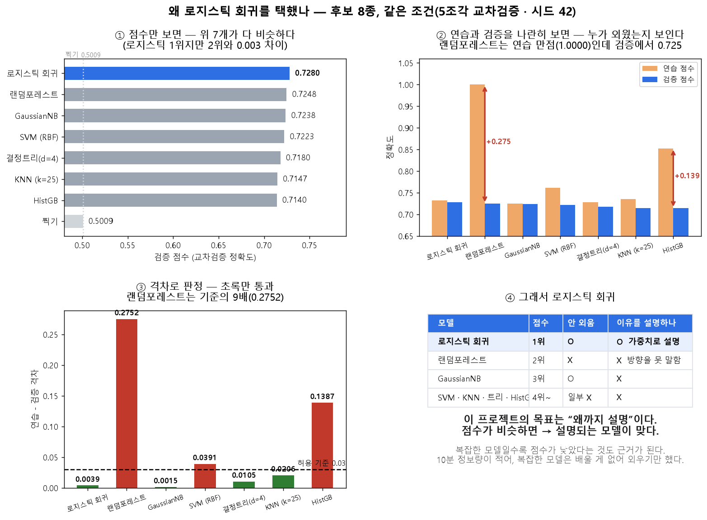
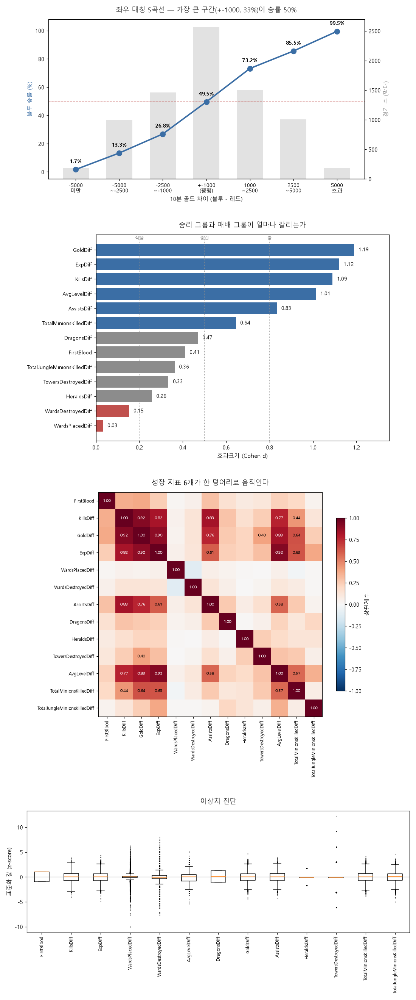
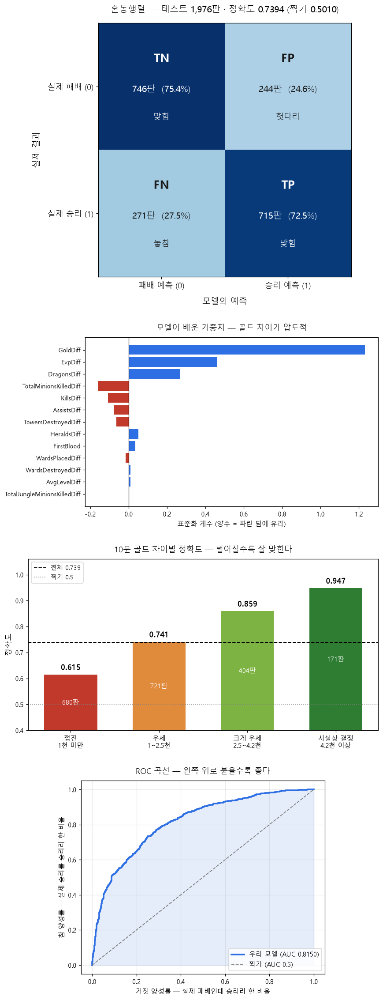
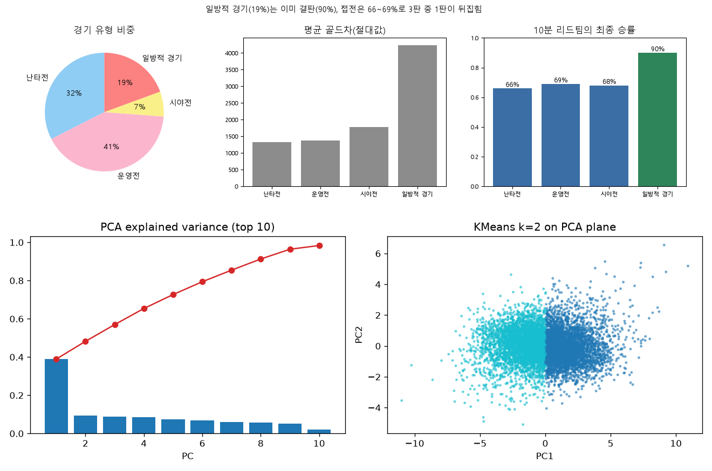
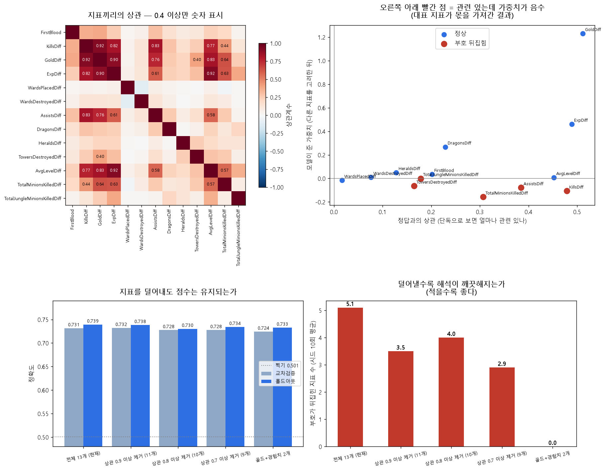
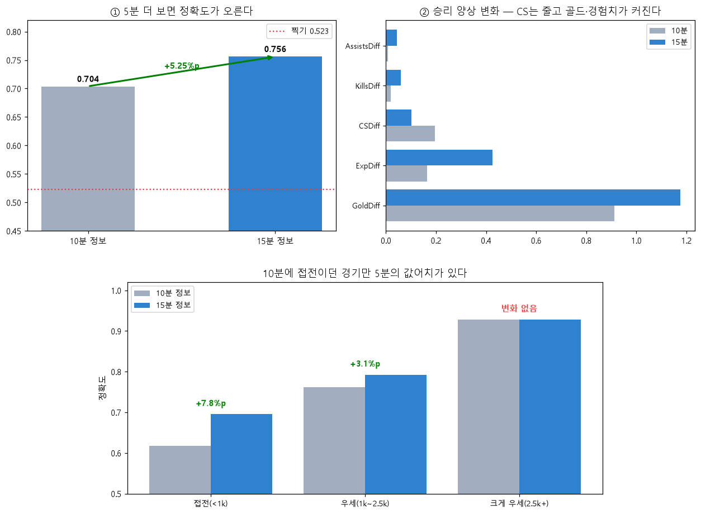

# LoL 경기는 언제 승부가 결정되는가?
### 인게임 시점별 경기 데이터 기반 승패 예측 및 핵심 승리요인 분석 — 4조

경기 시작 **10분 시점의 상황만 보고** 최종 승패를 예측하고, **왜 그렇게 판단했는지**까지 설명하는 서비스.

**서비스** https://p4.sumzip.com · **저장소** https://github.com/wpalswpa/project2608

| | |
|---|---|
| **정확도** | **0.7366 ± 0.0081** (아무렇게나 찍으면 0.5010 → **+23.8%p**) |
| **승패를 가르는 것** | 골드 차이 > 경험치 차이 > 드래곤 — 서로 다른 두 방법이 같은 순위 |
| **언제 틀리나** | 팽팽한 경기 0.615 ↔ 크게 벌어진 경기 0.947 |
| **5분을 더 보면** | +5.25%p — 단, 그 이득은 **팽팽한 경기에만** |

### 프로젝트는 3단계로 진행했습니다

| | 단계 | 하는 일 | 답하는 질문 |
|---|---|---|---|
| **페이즈 1** | 승패 예측과 원인 분석 | 기능 → 모델 → 피처 → 데이터 순서로 만들고 검증 | 10분 정보로 얼마나 맞히나? 무엇이 승패를 가르나? |
| **페이즈 2** | 상관 재분석 | 겹치는 지표를 히트맵으로 확인하고 덜어낸 뒤 **같은 절차를 한 번 더** | 골드가 가중치를 다 가져간 건 아닌가? 지표를 바꾸면 달라지나? |
| **페이즈 3** | 시점 비교 | 추가 데이터로 10분 vs 15분 | 5분을 더 보면 무엇이 달라지나? |

페이즈 2에서 **"같은 시점 안에서는 지표를 바꿔도 소용없다"**를 확인했고,
그래서 페이즈 3에서 **지표가 아니라 시점을 바꿔봤습니다.** 세 단계가 이어져 있습니다.

---

## 1. 무엇을 만들었나

경기 10분 시점의 숫자 13개를 넣으면 세 가지를 돌려줍니다.

1. **이길 확률** — "파란 팀이 이길 확률 73%"
2. **그 이유** — "돈 차이 때문에 유리하고, 그다음은 경험치"
3. **믿어도 되는지** — "지금은 팽팽한 경기라 이 예측은 자주 틀립니다"

### 왜 이걸 만들었나

- **관전의 "왜"가 비어 있습니다.** 중계에 승률이 뜨지만 산출 근거가 비공개라, 시청자는 "지금 63%"를 봐도 왜 유리한지 모릅니다.
- **분석의 접근성 격차.** 프로팀은 전담 분석 인력이 있지만 일반 유저는 없습니다. 공개 데이터와 기본 도구만으로 복기 우선순위를 뽑는 절차를 보이려 했습니다.
- **통제되지 않은 시점 비교.** "초반에 이미 기울었다"는 통념은 많지만, 같은 경기·같은 지표로 시점만 바꿔 비교한 결과는 찾기 어렵습니다.

### 게임을 모르셔도 되는 최소한의 설명

5명씩 두 팀(파랑 vs 빨강)이 상대 본진을 먼저 부수면 이깁니다. 무승부는 없습니다.
경기 중 **골드(돈)·경험치(레벨)·킬·드래곤(버프)** 같은 숫자가 계속 쌓이므로,
10분 시점에는 이미 "중간 성적표"가 존재합니다. 그 성적표만으로 최종 승패를 맞히는 것이 이 프로젝트입니다.

---

## 2. 페이즈 1 — 승패 예측과 원인 분석

### 만든 순서: 기능 → 모델 → 피처 → 데이터

#### ① 기능부터 정했습니다

"승률 + 이유 + 경고" 세 가지를 돌려주기로 먼저 정했습니다.
**"이유"를 반드시 낸다**는 조건이 이후 모든 선택을 결정했습니다 — 특히 모델 선택에서요.

#### ② 모델 — 후보 8개를 같은 조건에서 비교

| 모델 | 교차검증 정확도 | 연습−검증 격차 | 판정 |
|---|---|---|---|
| **로지스틱 회귀** | **0.7280 ± 0.0163** | **+0.0039** | ✅ 채택 |
| 랜덤포레스트 | 0.7248 | +0.2752 (연습 1.0000) | ❌ 통째로 외움 |
| GaussianNB | 0.7238 | +0.0015 | 2위 이하 |
| SVM (RBF) | 0.7223 | +0.0391 | ❌ 기준 초과 |
| 결정트리 · KNN · HistGB | 0.7140~0.7180 | 최대 +0.1387 | ❌ / 하위 |
| 찍기 (기준선) | 0.5009 | — | 비교 출발선 |



**성능이 모델 복잡도의 정확히 역순이었습니다.** 랜덤포레스트는 연습 점수가 만점(1.0000)인데
처음 보는 데이터에서 0.7248로 떨어집니다. 외운 것이지 배운 게 아닙니다.

로지스틱을 고른 이유는 ① 점수 1위 ② 외우지 않음 ③ **가중치로 "왜"를 설명할 수 있음**입니다.
①에서 "이유를 반드시 낸다"고 정했으므로 세 번째가 결정적이었습니다.

**튜닝은 하지 않았습니다.** 골드차 1개만 넣어도 0.7313, 2개면 0.7328로 전체와 거의 같습니다.
정보가 두 지표에 몰려 있어 조정해도 짜낼 것이 없습니다. 남은 시간은 해석과 문서에 썼습니다.

#### ③ 피처 — 38개에서 13개로

원본 38개 중 **11개가 중복**이었습니다.

| 중복 유형 | 예 |
|---|---|
| 거울 컬럼 | `redGoldDiff = -blueGoldDiff` (부호만 반대) |
| 상수배 | `blueGoldPerMin = blueTotalGold ÷ 10` |
| 합계 컬럼 | `EliteMonsters = Dragons + Heralds` (두 컬럼 비교로는 안 걸려 뒤늦게 발견) |

중복을 지우고 남은 것을 **"파란 팀 − 빨간 팀" 차이값 13개**로 합쳤습니다.
지표는 절반이 됐는데 정확도는 오히려 올랐습니다(0.7334 → 0.7369). 불필요한 컬럼이 잡음이었다는 뜻입니다.
모든 지표가 **"양수면 파란 팀 우세"** 로 통일되어 해석도 단순해졌습니다.

#### ④ 데이터 — 검증부터

| 항목 | 값 |
|---|---|
| 출처 | [Kaggle — LoL Diamond Ranked Games (10 min)](https://www.kaggle.com/datasets/bobbyscience/league-of-legends-diamond-ranked-games-10-min) |
| 규모 | **9,879행 × 40컬럼** (한 행 = 경기 한 판) |
| 결측 / 중복 | **0건 / 0건** |
| 승패 비율 | 50.10 : 49.90 — **거의 반반** |

승패가 반반이라 **정확도를 1순위 지표로 쓰는 것이 정당**합니다. 치우쳐 있었다면 F1을 썼어야 합니다.

**가장 중요한 규칙 — 분할이 먼저입니다.** 어떤 전처리보다 먼저 학습 7,903 / 시험 1,976으로
나누고 시험지를 봉인했습니다. 전처리를 먼저 하면 시험 데이터의 정보가 학습에 새어 들어가
점수가 가짜로 오릅니다(누수). 오류가 나지 않아 모르고 지나가기 가장 쉬운 실수입니다.



골드 차이가 벌어질수록 승률이 S자로 매끄럽게 올라갑니다. 그런데 **경기가 가장 많이 몰린
±1,000 구간은 승률이 반반**입니다. 이 그림이 뒤에 나올 결과 대부분을 예고합니다.

### 페이즈 1의 결과



#### 얼마나 맞히나

| 지표 | 값 |
|---|---|
| **대표 정확도** | **0.7366 ± 0.0081** (분할을 10번 바꿔 재학습한 평균) |
| 단일 분할 | 0.7394 (시드 42) |
| 교차검증 | 0.7315 ± 0.0153 · 연습−검증 격차 +0.0022 |
| F1 / AUC / Brier | 0.7352 / 0.8150 / 0.1756 |
| 혼동행렬 | TN 746 · FP 244 / FN 271 · TP 715 |

**틀리는 방향이 244 대 271로 거의 같습니다.** 어느 쪽도 편들지 않는다는 뜻입니다.

> 0.7394는 특정 분할 하나의 값이라, **반복 평균과 함께** 말하는 것이 정직합니다.
> 10번 모두 목표(0.70)를 넘었습니다.

#### 무엇이 승패를 가르나

| 순위 | 요인 | 표준화 계수 | permutation |
|---|---|---|---|
| 1 | **골드(돈) 차이** | +1.231 | 0.185 |
| 2 | 경험치 차이 | +0.461 | 0.032 |
| 3 | 드래곤 차이 | +0.267 | 0.011 |

성격이 다른 두 방법이 **같은 순위**를 냈고, 분할을 10번 바꿔도 1-2-3위가 한 번도 안 바뀌었습니다.

**킬은 왜 없나** — 킬만 보면 승패를 잘 가릅니다(13개 중 3위). 그런데 킬을 하면 돈을 받으므로
**킬의 가치가 이미 골드 차이에 들어가 있습니다**(상관 +0.92). 골드를 아는 모델에게 킬은
새로 알려줄 게 없어 가중치가 음수(−0.11)로 나옵니다.
정확한 해석은 **"킬은 돈으로 환산됐을 때만 의미가 있다"** 입니다.

#### 언제 틀리나

| 10분 골드 차이 | 비중 | 정확도 |
|---|---|---|
| 팽팽함 (1,000 미만) | 34.4% | **0.615** |
| 조금 앞섬 (1,000~2,500) | 36.5% | 0.741 |
| 많이 앞섬 (2,500~4,200) | 20.4% | 0.859 |
| 사실상 결정 (4,200+) | 8.7% | **0.947** |

팽팽한 경기를 못 맞히는 건 모델이 부족해서가 아니라 **그 시점 정보에 아직 승패의 단서가
없기 때문**입니다. 이 한계는 `model_card.md`에 명시했고, 서비스 화면에도 경고가 뜹니다.

#### 경기를 성격별로 묶어보면 (비지도학습)



승패 정보를 지운 지표 5개로 묶으니 4가지가 나왔습니다.

| 유형 | 비중 | 특징 | 10분 리드팀의 최종 승률 |
|---|---|---|---|
| 운영전 | 41% | 킬 적음(9), 조용히 성장 | 69% |
| 난타전 | 32% | 킬 많음(15) | 66% |
| 일방적 경기 | 19% | 골드차 4,240 | **90%** |
| 시야전 | 7% | 와드 3배(119개) | 68% |

일방적 경기만 이미 결판이 나 있고 나머지는 3판 중 1판이 뒤집힙니다.
오류 분석과 같은 결론이 **다른 방법에서도** 나온 것입니다.
※ 4개라는 개수는 지표가 정해준 게 아니라 설명하기 좋아서 고른 값입니다(한계).

---

## 3. 페이즈 2 — 상관 재분석

계수를 보니 이상한 게 있었습니다. **킬은 승패와 분명히 관련 있는데 가중치가 음수**입니다.
그대로 발표하면 "킬을 하면 진다"는 잘못된 결론이 나옵니다. 그래서 되짚었습니다.



**상관 0.7 이상인 쌍이 8개**였습니다(킬↔골드 0.918, 경험치↔레벨 0.920).
VIF도 골드 23.4 · 킬 14.1 · 경험치 12.9로 **중복이 심합니다**(10 이상이면 중복).
그 결과 **관련 있는데 가중치가 음수인 지표가 5개** 나옵니다(오른쪽 그림의 빨간 점).

### 겹치는 지표를 덜어내고 다시 비교

| 구성 | 지표 수 | 교차검증 | 홀드아웃 | 부호 뒤집힌 지표 |
|---|---|---|---|---|
| 전체 13개 (현재) | 13 | 0.7315 | **0.7394** | 5.1개 |
| **상관 0.9 이상 제거** | **11** | **0.7321** | 0.7384 | **3.5개** |
| 상관 0.7 이상 제거 | 9 | 0.7276 | 0.7343 | 2.9개 |
| 골드+경험치 2개 | 2 | 0.7243 | 0.7328 | **0개** |

**알게 된 것 세 가지**

1. **덜어내도 점수가 안 떨어집니다.** 11개가 교차검증에서 오히려 미세하게 높고, 홀드아웃 차이 0.001은 표준편차(±0.015) 안입니다.
2. **해석은 확실히 깨끗해집니다** — 뒤집힘이 5.1 → 3.5개로 줄었습니다.
3. **1위 요인은 무엇을 빼도 골드입니다.** 모든 구성에서 시드 10회 전부 골드가 1위였습니다. 결론이 지표 구성에 흔들리지 않는다는 뜻이라, 오히려 더 단단해졌습니다.

**그래서 13개를 유지하되, 계수를 그대로 보여주지 않기로 했습니다.**
점수 차이가 없으니 바꿀 이유가 없고, 13개를 유지해야 드래곤·전령 같은 지표를 순위표에 올릴 수 있습니다.
대신 사용자 화면에는 **효과크기 순위**를 쓰고, 계수는 "다른 지표를 고려한 뒤 남은 몫"이라는 설명과 함께만 제시합니다.

여기까지가 **10분 시점 안에서 할 수 있는 것의 끝**입니다. 지표를 더 넣어도, 빼도 점수가 안 변합니다.
**10분 정보량 자체가 상한**이라는 뜻이고, 그래서 다음은 시점을 바꿔봐야 합니다.

---

## 4. 페이즈 3 — 시점 비교 (10분 vs 15분)

페이즈 2에서 **"지표를 바꿔도 소용없다"**는 것을 확인했습니다.
그렇다면 남은 방법은 하나뿐입니다 — **시점을 바꿔보는 것.**



프로 경기 데이터로 **시점만** 바꿔 비교했습니다. 공정하게 재려면 시점 말고는 전부 같아야 하므로,
10분·15분 기록이 **둘 다 있는 같은 경기 10,656판**만 쓰고, 두 시점에 똑같이 존재하는 지표 5개만 넣었습니다.
원본은 한 경기가 두 줄이라 그대로 쓰면 같은 경기가 학습·시험 양쪽에 들어가므로 한 줄만 남겼습니다.

| 10분 상황 | 비중 | 10분 정보 | 15분 정보 | 개선 |
|---|---|---|---|---|
| **팽팽함 (1,000 미만)** | 52.1% | 0.617 | 0.696 | **+7.8%p** |
| 조금 앞섬 | 37.5% | 0.761 | 0.793 | +3.1%p |
| 많이 앞섬 (2,500+) | 10.4% | 0.928 | 0.928 | **±0.0%p** |

전체로는 +5.25%p 오르지만, **이득이 경기마다 완전히 다릅니다.**
이미 벌어진 경기는 5분을 더 봐도 전혀 나아지지 않고, 팽팽한 경기만 크게 오릅니다.
10분에 팽팽했던 경기의 **59%가 그 5분 사이에 한쪽으로 기울기** 때문입니다.

**제목의 답** — 경기의 약 10%는 10분에 이미 끝나 있고, 절반쯤 되는 팽팽한 경기는
그 6할이 10~15분에 갈립니다. "초반에 다 기운다"도 "끝까지 모른다"도 둘 다 틀렸습니다.

---

## 5. 서비스

**https://p4.sumzip.com** — 숫자를 넣으면 승률과 이유가 나옵니다. 예시 버튼 3개로 바로 확인할 수 있습니다.

```
브라우저 → web/frontend.py (9504) → web/backend.py (9524) → predict.py → model.joblib
             화면·전달만            예측 API             예측 전담      학습된 모델
```

**예측 계산은 `predict.py` 한 곳에만 있습니다.** 웹은 그 결과를 보여주기만 합니다.
계산이 두 곳에 있으면 화면 확률과 모델 확률이 갈라져도 아무도 모르기 때문입니다.
실제로 같은 답을 내는지 자동 테스트(`web/test_parity.py`)로 검증하며, 세 경로가 소수점까지 일치합니다.

**"골드차가 크면 승리" 같은 사람이 만든 규칙은 한 줄도 없습니다.** 넣는 순간
"데이터가 검증했다"는 말이 거짓이 되기 때문입니다.

```bash
./check_project.sh start | stop | restart | status | logs
```

---

## 6. 재현 방법

```bash
pip install -r requirements.txt          # Python 3.11 · scikit-learn 1.9.0

python src/day1_baseline.py              # 데이터 확인 · 분할 · 찍기 점수 0.5009
python src/day2_features_cluster.py      # 중복 정리 · 차이 지표 13개 · 경기 유형
python src/finalize_model.py             # 최종 학습 · 채점 0.7394 · 모델 저장
python src/feature_reduction.py          # 페이즈 2 — 상관 분석 후 재구성
python src/timepoint_compare.py          # 10분 vs 15분 (보너스)
python src/repeat_check.py               # 분할을 10번 바꿔 재학습
python predict.py --demo                 # 예측 확인 (51.2% / 94.6% / 16.8%)
python src/factcheck.py                  # 문서 숫자 자동 점검 (0건이어야 정상)
```

데이터 CSV는 저작권·용량 때문에 저장소에 없습니다. `data/README.md`의 링크에서 받으세요.
DB 접속 정보가 없으면 자동으로 로컬 CSV를 씁니다(계산식 동일).

**재현성 규약 8항목** — 시드 42 · 분할 파일 저장 · 절대경로 금지 · 버전 고정 · 순차 실행 ·
전처리는 Pipeline 안 · 실험 기록 `runs.csv` · **행 정렬 고정(`gameId`)**

마지막 항목은 직접 겪고 추가했습니다. 시드를 고정해도 **읽는 순서가 다르면 분할이 달라집니다.**

---

## 7. 무엇이 어디에 있나

| 보려는 것 | 파일 |
|---|---|
| **평가 결과 (제출용)** | `reports/model_report.ipynb` — 모델·데이터·평가·혼동행렬 |
| **발표에 쓸 숫자와 근거** | `reports/metrics_summary.md` — 지표 표 + 예상 질문 5개의 답 |
| 페이즈 2 상세 | `reports/phase2_feature_reduction.md` |
| 모델 사용설명서·금지 상황 | `model_card.md` |
| 팀 작업 방법 | `docs/TEAM_WORKFLOW.md` |
| 서버 배포 절차 | `docs/deploy.md` |
| 개념 공부 | `docs/study.md` — 용어를 풀어쓴 가이드 |

```
├─ predict.py              예측 진입점 (예측 로직은 여기 하나뿐)
├─ check_project.sh        서비스 시작·중지·재시작
├─ artifacts/              model.joblib · schema.json
├─ src/                    분석 스크립트
├─ web/                    프론트(9504) · 백엔드(9524)
├─ notebooks/              전 과정 재현 노트북
├─ reports/                결과 — 그림 5장 + 보고서 3개 (원본은 figures/ tables/)
└─ docs/                   기획·명세·계획·작업·공부 자료
```

**산출물 6종** — README · 재현 노트북 · `model.joblib` · `schema.json` · `predict.py` · `model_card.md`
저장한 모델은 다시 불러왔을 때 예측이 같은지 자동으로 확인합니다.

---

## 8. 한계

- **팽팽한 경기는 10분 정보로 못 맞힙니다.** 모델이 아니라 정보량의 한계입니다.
- **수집 시점 패치·다이아 티어에 한정**됩니다. 게임이 바뀌면 다시 학습해야 합니다.
- **10분 vs 15분은 프로 경기 결과**라 일반 랭크에 그대로 적용할 수 없습니다.
  같은 팀의 경기가 학습·시험 양쪽에 들어가 절대 수치는 좋게 나왔을 수 있습니다(두 시점 간 차이 비교는 유효).
- **경기 유형 4개는 지표가 정해준 값이 아니라** 설명하기 좋아서 고른 구획입니다.
- **정성 스모크 테스트(SC-7)** 는 1명에게 실행했습니다(3문항 중 2개 정답). 킬을 오해한 오답을 근거로 부록에 킬 설명을 보탰지만, 보완본으로 재확인하지는 못했습니다.
- 확률 자체가 얼마나 정확한지(캘리브레이션)는 검증하지 않았습니다.

---

## 부록 — 관전 포인트 (게임을 몰라도 이것만)

1. **골드(돈) 차이** — 4,200 이상이면 사실상 결정(적중률 95%), 1,000 미만이면 이제 시작(적중률 62%)
2. **경험치(레벨) 차이** — 돈과 별개로 레벨이 앞서면 유리
3. **드래곤** — 팀 전체가 강해지는 버프

**킬은 왜 목록에 없나** — 킬을 많이 했어도 **돈 차이가 안 벌어졌다면 아직 유리한 게 아닙니다.**
킬을 하면 돈을 받기 때문에, 킬의 가치는 이미 돈 차이 안에 들어가 있습니다.
그래서 "킬 몇 개 앞섰나"가 아니라 **"그 싸움이 돈 격차로 이어졌나"** 를 봐야 합니다.

**한 줄 요약 — 골드차 4천이면 끝난 경기, 1천 미만이면 이제 시작입니다. 킬은 돈으로 바뀌었을 때만 의미가 있습니다.**
