# LoL 경기는 언제 승부가 결정되는가?
### 인게임 시점별 경기 데이터 기반 승패 예측 및 핵심 승리요인 분석 — 4조

경기 시작 **10분 시점의 상황만 보고** 최종 승패를 예측하고, **왜 그렇게 판단했는지**까지 설명하는 서비스.

**서비스** https://p4.sumzip.com · **저장소** https://github.com/wpalswpa/project2608

| | |
|---|---|
| **정확도** | **0.7366 ± 0.0081** (아무렇게나 찍으면 0.5010 → **+23.8%p**) |
| **승패를 가르는 것** | 골드 차이 > 경험치 차이 > 드래곤 — 서로 다른 두 방법이 같은 순위 |
| **언제 틀리나** | 팽팽한 경기 0.615 ↔ 크게 벌어진 경기 0.947 |
| **5분을 더 보면** | +5.25%p — 단, 그 이득은 **팽팽한 경기에만** |

### 프로젝트는 4단계로 진행했습니다

| | 단계 | 하는 일 | 답하는 질문 |
|---|---|---|---|
| **페이즈 1** | 승패 예측과 원인 분석 | 기능 → 모델 → 피처 → 데이터 순서로 만들고 검증 | 10분 정보로 얼마나 맞히나? 무엇이 승패를 가르나? |
| **페이즈 2** | 골드를 빼고 재분석 | 히트맵으로 중복의 중심이 골드임을 확인하고, **골드를 빼고 처음부터 다시 학습** | 골드 의존도가 너무 컸다. 빼면 무엇이 달라지나? |
| **페이즈 3** | 군집화와 데이터 축소 | PCA로 정보가 몇 축인지 재고, 군집 모델 4종 비교, 나이브베이즈 추가 학습 | 0.73이 정말 한계인가? 승패 말고 다른 구조는? |
| **페이즈 4** | 시점 비교 | 추가 데이터로 10분 vs 15분 | 5분을 더 보면 무엇이 달라지나? |

페이즈 1에서 골드가 압도적 1위로 나왔는데, 그 옆에서 킬 계수가 음수로 나왔습니다.
페이즈 2에서 **골드를 빼보니 킬이 +0.508로 살아나고 점수는 0.002밖에 안 떨어졌습니다** — 지표를 바꿔도 10분 안에서는 상한이 같다는 뜻입니다.
페이즈 3에서 그 상한을 다른 각도로 두드려봤습니다 — 차원을 줄여도(PCA), 묶는 모델을 바꿔도(군집 4종), 예측 모델을 바꿔도(나이브베이즈) **0.73은 그대로**였습니다.
상한이 모델이 아니라 정보량이라는 게 확실해졌으니, 페이즈 4에서 **시점 자체를 바꿨습니다.** 네 단계가 이어져 있습니다.

아래 본문도 이 순서대로입니다 — 페이즈 1 → 2 → 3 → 4 → 서비스.

---

# 무엇을 만들었나

경기 10분 시점의 숫자 13개를 넣으면 세 가지를 돌려줍니다.

1. **이길 확률** — "파란 팀이 이길 확률 73%"
2. **그 이유** — "돈 차이 때문에 유리하고, 그다음은 경험치"
3. **믿어도 되는지** — "지금은 팽팽한 경기라 이 예측은 자주 틀립니다"

### 왜 이걸 만들었나

- **관전의 "왜"가 비어 있습니다.** 중계에 승률이 뜨지만 산출 근거가 비공개라, 시청자는 "지금 63%"를 봐도 왜 유리한지 모릅니다.
- **분석의 접근성 격차.** 프로팀은 전담 분석 인력이 있지만 일반 유저는 없습니다. 공개 데이터와 기본 도구만으로 복기 우선순위를 뽑는 절차를 보이려 했습니다.
- **통제되지 않은 시점 비교.** "초반에 이미 기울었다"는 통념은 많지만, 같은 경기·같은 지표로 시점만 바꿔 비교한 결과는 찾기 어렵습니다.

### 게임을 모르셔도 되는 최소한의 설명

5명씩 두 팀(파랑 vs 빨강)이 상대 본진을 먼저 부수면 이깁니다. 무승부는 없습니다.
경기 중 **골드(돈)·경험치(레벨)·킬·드래곤(버프)** 같은 숫자가 계속 쌓이므로,
10분 시점에는 이미 "중간 성적표"가 존재합니다. 그 성적표만으로 최종 승패를 맞히는 것이 이 프로젝트입니다.

---

<br>

# 페이즈 1 · 승패 예측과 원인 분석

> **묻는 것** — 10분 정보로 얼마나 맞히나? 무엇이 승패를 가르나?
> **답** — 100판 중 74판 적중. 골드 차이가 압도적 1위.

## 1-1. 정한 순서 — 기능 → 모델 → 피처 → 데이터

**이건 "결정한 순서"이지 "작업한 순서"가 아닙니다.** 무엇이 무엇을 제약했는지를 보이려고 이 순서로 적었습니다.
"이유를 반드시 낸다"가 모델을 정했고, 모델이 피처 형태를 정했습니다.

**실제 작업은 CRISP-DM 순서대로 했습니다** — 데이터 이해 → 데이터 준비 → **분할** → 모델링 → 평가.
아래 ④가 그 과정이고, **분할 진단이 그 종착점**입니다. 분할이 끝나야 모델링을 시작할 수 있습니다.

#### ① 기능부터 정했습니다

"승률 + 이유 + 경고" 세 가지를 돌려주기로 먼저 정했습니다.
**"이유"를 반드시 낸다**는 조건이 이후 모든 선택을 결정했습니다 — 특히 모델 선택에서요.

#### ② 모델 — 후보 8개를 같은 조건에서 비교

| 모델 | 교차검증 정확도 | 연습−검증 격차 | 판정 |
|---|---|---|---|
| **로지스틱 회귀** | **0.7280 ± 0.0163** | **+0.0039** | ✅ 채택 |
| 랜덤포레스트 | 0.7248 | +0.2752 (연습 1.0000) | ❌ 통째로 외움 |
| GaussianNB | 0.7238 | +0.0015 | 2위 이하 |
| SVM (RBF) | 0.7223 | +0.0391 | ❌ 기준 초과 |
| 결정트리 · KNN · HistGB | 0.7140~0.7180 | 최대 +0.1387 | ❌ / 하위 |
| 찍기 (기준선) | 0.5009 | — | 비교 출발선 |

모델을 고른 과정을 네 장면으로 나눠 봅니다.

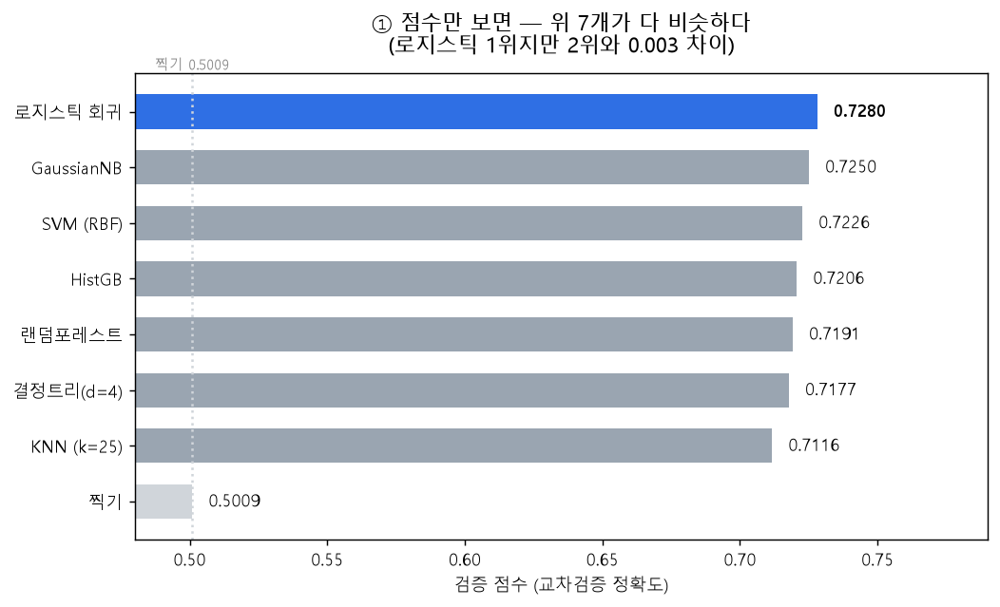

**왜 이걸 봤나** — 가장 먼저 물을 것은 "어느 게 제일 잘 맞히나"입니다.
8종을 **똑같은 조건**(5조각 교차검증, 시드 42)에서 돌려 줄을 세웠습니다.

**결과 — 점수로는 못 고릅니다.** 로지스틱이 1위(0.7280)지만 2위와 **0.003 차이**입니다.
위 7개가 사실상 다 비슷합니다. 아래 찍기(0.5009)와 견주면 전부 확실히 낫지만, **자기들끼리는 구별이 안 됩니다.**

**그래서** — 점수 말고 다른 기준이 필요합니다. 다음 장면으로 넘어갑니다.

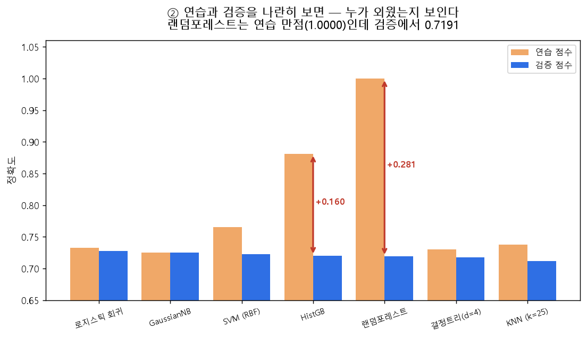

**왜 이걸 봤나** — 점수가 비슷할 때 갈라야 할 것은 **"배웠나, 외웠나"** 입니다.
연습 문제(학습 데이터) 점수와 처음 보는 문제(검증) 점수를 나란히 놓으면 드러납니다.

**결과 — 랜덤포레스트가 연습 만점(1.0000)인데 검증은 0.725입니다.**
답을 통째로 외운 것입니다. HistGB도 0.8527 → 0.7140으로 크게 떨어집니다.
반면 로지스틱은 0.7319 → 0.7280으로 **거의 안 떨어집니다.**

**그래서** — 외운 모델은 새 경기에서 무너집니다. 이 격차를 기준으로 판정합니다.

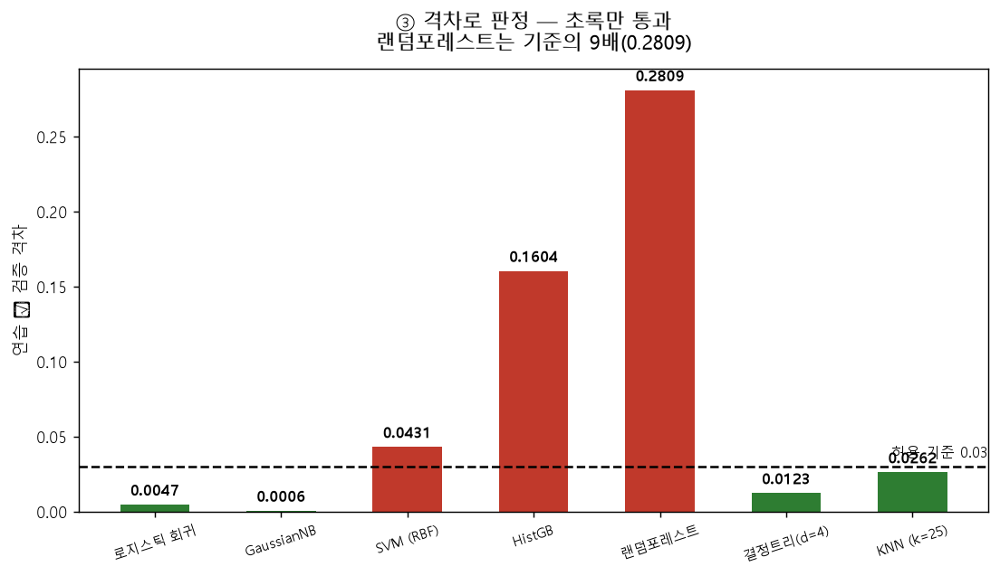

**왜 이걸 봤나** — 앞 장면을 **숫자 하나로** 만들어 합격/불합격을 가르기 위해서입니다.
격차 = 연습 − 검증. 이 프로젝트는 **0.03**을 기준으로 잡았습니다.

**결과 — 초록(통과)이 셋뿐입니다.** 랜덤포레스트는 0.2752로 **기준의 9배**입니다.
로지스틱은 0.0039로 통과합니다.

**그래서** — 남은 후보는 로지스틱·GaussianNB·결정트리입니다. 여기서 마지막 기준이 필요합니다.

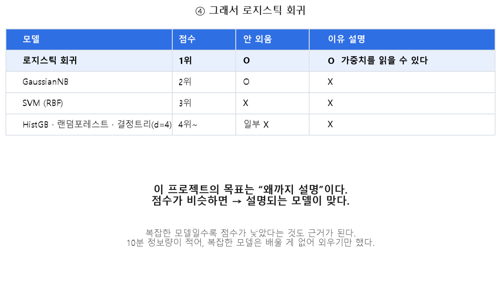

**왜 이걸 봤나** — 점수와 과적합만으로는 아직 하나로 못 좁힙니다.
그래서 ①에서 정한 조건 **"이유를 반드시 낸다"** 를 마지막 기준으로 씁니다.

**결과 — 로지스틱만 세 칸을 다 통과합니다.** 점수 1위, 안 외움, 그리고 **가중치를 읽어 "왜"를 말할 수 있음**.
랜덤포레스트는 어떤 지표가 중요한지는 말해도 **그게 유리한 쪽인지 불리한 쪽인지(+/−)를 못 말합니다.**

**그래서 로지스틱 회귀입니다.** 덧붙여, **성능이 모델 복잡도의 정확히 역순**이었다는 것도 근거가 됩니다.
10분 정보량이 적어서 복잡한 모델은 배울 게 없어 외우기만 한 것입니다.

*(개념이 낯설면 → [STUDY.md](STUDY.md) **6번 과적합 · 7번 교차검증**)*

**튜닝은 하지 않았습니다.** 골드차 1개만 넣어도 0.7313, 2개면 0.7328로 전체와 거의 같습니다.
정보가 두 지표에 몰려 있어 조정해도 짜낼 것이 없습니다. 남은 시간은 해석과 문서에 썼습니다.

#### ③ 피처 — 38개에서 13개로

원본 38개 중 **11개가 중복**이었습니다.

| 중복 유형 | 예 |
|---|---|
| 거울 컬럼 | `redGoldDiff = -blueGoldDiff` (부호만 반대) |
| 상수배 | `blueGoldPerMin = blueTotalGold ÷ 10` |
| 합계 컬럼 | `EliteMonsters = Dragons + Heralds` (두 컬럼 비교로는 안 걸려 뒤늦게 발견) |

중복을 지우고 남은 것을 **"파란 팀 − 빨간 팀" 차이값 13개**로 합쳤습니다.
지표는 절반이 됐는데 정확도는 오히려 올랐습니다(0.7334 → 0.7369). 불필요한 컬럼이 잡음이었다는 뜻입니다.
모든 지표가 **"양수면 파란 팀 우세"** 로 통일되어 해석도 단순해졌습니다.

*(왜 차이로 바꾸는지 → [STUDY.md](STUDY.md) **9번 피처 공학**)*

#### ④ 데이터 — 검증부터

| 항목 | 값 |
|---|---|
| 출처 | [Kaggle — LoL Diamond Ranked Games (10 min)](https://www.kaggle.com/datasets/bobbyscience/league-of-legends-diamond-ranked-games-10-min) |
| 규모 | **9,879행 × 40컬럼** (한 행 = 경기 한 판) |
| 결측 / 중복 | **0건 / 0건** |
| 승패 비율 | 50.10 : 49.90 — **거의 반반** |

승패가 반반이라 **정확도를 1순위 지표로 쓰는 것이 정당**합니다. 치우쳐 있었다면 F1을 썼어야 합니다.

**가장 중요한 규칙 — 분할이 먼저입니다.** 어떤 전처리보다 먼저 학습 7,903 / 시험 1,976으로
나누고 시험지를 봉인했습니다. 전처리를 먼저 하면 시험 데이터의 정보가 학습에 새어 들어가
점수가 가짜로 오릅니다(누수). 오류가 나지 않아 모르고 지나가기 가장 쉬운 실수입니다.

**아래 EDA는 전부 학습셋 7,903행만 보고 그렸습니다.** 시험지를 열어보고 그린 그림으로
"이 지표가 중요하더라"라고 말하면, 그건 답을 보고 문제를 푼 것입니다.

각 그림이 **어떤 질문에 답하려고 그린 것인지**부터 적습니다.

#### 확인 1 — 골드가 벌어지면 정말 이기나?

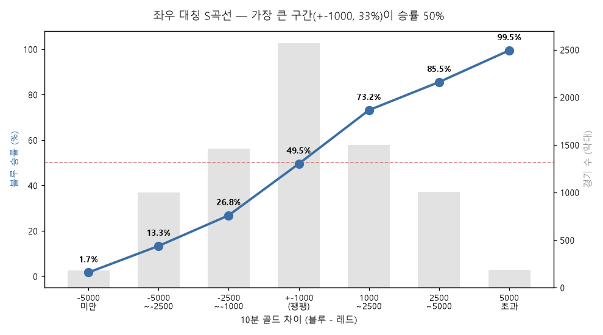

가로축은 10분 골드 차이, 파란 선은 그 구간의 실제 승률, 회색 막대는 그 구간의 경기 수입니다.

**결과** — 승률이 S자로 매끄럽게 올라갑니다. 골드 5,000 이상 뒤진 경기는 1.7%만 이기고,
5,000 이상 앞선 경기는 99.5% 이깁니다. 가설대로입니다.

**그런데 중요한 건 가운데입니다.** 회색 막대가 가장 높은 구간(±1,000)이 **전체의 33%**인데
그 구간 승률은 **49.5% — 사실상 동전 던지기**입니다.
즉 **데이터가 가장 많이 몰린 곳에서 골드가 아무 말도 못 합니다.**
뒤에 나올 "접전 정확도 0.615"라는 한계가 이미 여기서 예고됩니다.

#### 확인 2 — 어떤 지표가 승패를 잘 가르나?

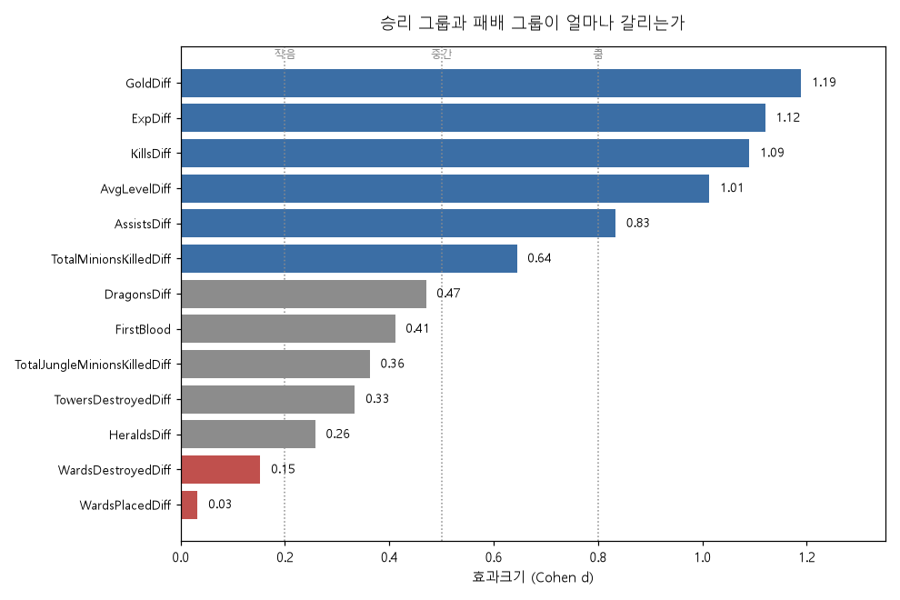

지표를 **하나씩만** 놓고 승리한 경기와 패배한 경기의 평균이 얼마나 벌어지는지 쟀습니다
(효과크기, Cohen's d). 0.8을 넘으면 "큰 차이"로 봅니다.

**결과** — 상위 4개가 **골드 1.19 · 경험치 1.12 · 킬 1.09 · 레벨 1.01**로 전부 성장 지표입니다.
반대로 **와드 설치는 0.03으로 사실상 0**입니다.

**그래서** — "시야를 많이 밝힌 팀이 이긴다"는 통념이 이 데이터에서는 **성립하지 않습니다.**
빼도 되지만, 통념이 틀렸다는 것 자체가 발표에 쓸 발견이라 해석용으로 남겼습니다.

#### 확인 3 — 지표끼리 겹치지 않나?

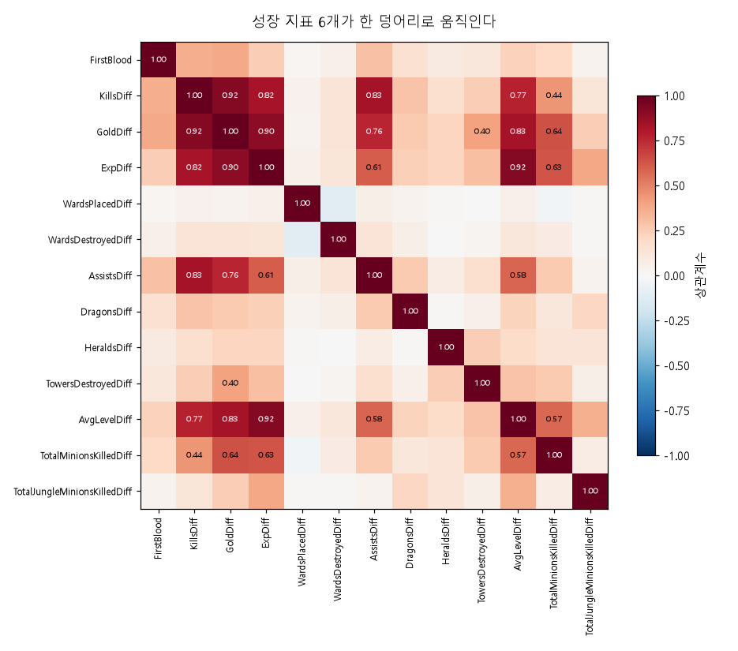

지표끼리 얼마나 같이 움직이는지 본 표입니다. 붉을수록 함께 움직입니다.

**결과** — 왼쪽 위에 **진한 덩어리 하나**가 보입니다. 킬↔골드 **0.92**, 경험치↔레벨 **0.92**,
골드↔경험치 **0.90** — **성장 지표 6개가 사실상 한 몸**입니다.
반면 와드 2개와 드래곤·전령은 어디와도 안 붙어 있습니다(거의 흰색).

**그래서** — 게임 규칙상 당연합니다. 킬을 해도, 미니언을 잡아도, 타워를 밀어도 **돈이 들어옵니다.**
문제는 이렇게 겹치면 **모델이 골드 하나에만 가중치를 몰아준다**는 것입니다.
**이 그림이 페이즈 2를 부른 원인**입니다.

#### 확인 4 — 튀는 값을 걷어내야 하나?

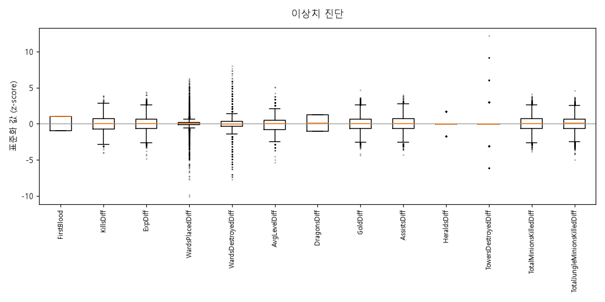

13개 지표를 같은 잣대(z-점수)로 세워 놓고 상자그림으로 본 것입니다.

**결과** — 튀는 점은 **와드 설치·제거에 몰려 있고**(z가 5~10까지), 정작 주력 지표인
골드·경험치·킬은 대부분 ±3 안에 있습니다.

**그래서 이상치를 제거하지 않았습니다.** 이유는 두 가지입니다.
와드는 계수가 0에 가까워 튀어도 예측에 영향이 없고,
골드가 크게 튄 경기는 오류가 아니라 **진짜로 한 팀이 압도한 경기**라 지우면 실제 현상을 지우게 됩니다.

#### 확인 5 — 분할이 제대로 됐나 (여기가 데이터 진단의 끝)

분할은 **한 번 잘못되면 이후 모든 점수가 거짓말이 되는데, 잘못돼도 오류가 안 나서 그냥 지나갑니다.**
그래서 네 가지를 명시적으로 확인했습니다.

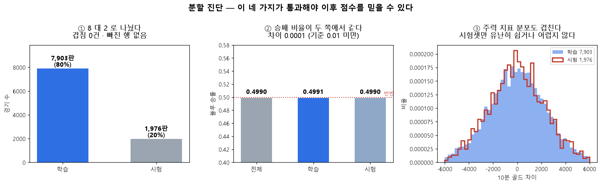

| 확인할 것 | 왜 봐야 하나 | 결과 |
|---|---|---|
| **인덱스 겹침** | 같은 경기가 양쪽에 있으면 이미 본 문제로 시험 보는 셈 | **0건** ✅ |
| **빠진 행** | 합쳐서 원본 9,879와 같아야 함 | **없음** ✅ |
| **층화** | 두 쪽 승패 비율이 달라지면 정확도를 견줄 수 없음 | 학습 0.4991 / 시험 0.4990 — **차이 0.0001** ✅ |
| **같은 경기 재등장** | `gameId`가 중복되면 사실상 겹침 | **0건** ✅ |

가운데 그림이 층화 결과입니다. **전체·학습·시험이 전부 0.499로 같습니다.**
오른쪽은 골드 차이 분포를 두 쪽에 겹쳐 그린 것인데 모양이 포개집니다 —
**시험셋만 유난히 쉽거나 어려운 경기로 채워지지 않았다**는 뜻입니다.

네 가지가 다 통과했으므로 **여기서부터 모델링을 시작해도 됩니다.**
분할 인덱스는 `data/splits/`에 저장해 두어, 누가 다시 돌려도 같은 문제·같은 시험지를 씁니다.

```bash
python src/split_check.py     # 위 네 가지를 다시 확인
```

*(왜 분할을 먼저 하는지 → [STUDY.md](STUDY.md) **3번 분할과 누수** · 표준화는 **5번**)*

## 1-2. 페이즈 1의 결과

#### 얼마나 맞히나

| 지표 | 값 |
|---|---|
| **대표 정확도** | **0.7366 ± 0.0081** (분할을 10번 바꿔 재학습한 평균) |
| 단일 분할 | 0.7394 (시드 42) |
| 교차검증 | 0.7315 ± 0.0153 · 연습−검증 격차 +0.0022 |
| F1 / AUC / Brier | 0.7352 / 0.8150 / 0.1756 |

> 0.7394는 특정 분할 하나의 값이라, **반복 평균과 함께** 말하는 것이 정직합니다.
> 10번 모두 목표(0.70)를 넘었습니다.

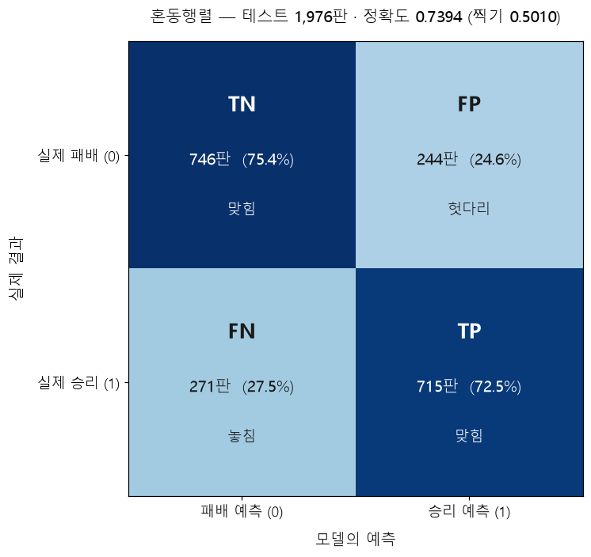

**틀린 것을 두 방향으로 나눠 센 표입니다.** 시험 데이터 1,976판을 네 칸에 넣었습니다 —
맞게 맞힌 두 칸(TN 746 · TP 715)과 틀린 두 칸(FP 244 · FN 271).

**결과** — 틀린 방향이 **244 대 271로 거의 같습니다.**
"블루가 이긴다고 했는데 진 경우"와 "진다고 했는데 이긴 경우"가 비슷하다는 뜻이라,
**모델이 어느 팀도 편들지 않습니다.** 한쪽으로 쏠렸다면 임계값(0.5)을 손봐야 했지만 그럴 필요가 없었습니다.

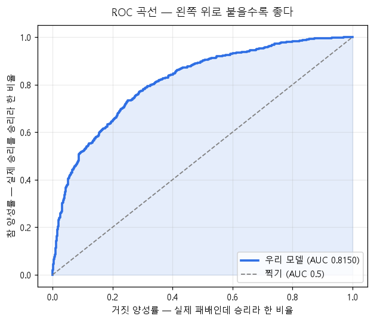

**정확도는 "0.5 넘으면 승리"라고 자를 때의 점수**입니다. 자르는 기준을 바꾸면 점수도 바뀝니다.
ROC는 **기준을 0부터 1까지 전부 바꿔가며** 성능을 본 것이고, 그 아래 넓이가 AUC입니다.

**결과 AUC 0.8150** — 아무렇게나 찍으면 0.5, 완벽하면 1.0입니다.
"승리 경기와 패배 경기를 무작위로 하나씩 뽑았을 때, **승리 경기에 더 높은 확률을 줄 가능성이 81.5%**"라는 뜻입니다.
기준을 어디로 잡든 성능이 유지된다는 확인이라, 임계값을 0.5로 둔 근거가 됩니다.

*(혼동행렬·AUC·F1이 각각 무엇인지 → [STUDY.md](STUDY.md) **8번 평가지표**)*

#### 무엇이 승패를 가르나

| 순위 | 요인 | 표준화 계수 | permutation |
|---|---|---|---|
| 1 | **골드(돈) 차이** | +1.231 | 0.185 |
| 2 | 경험치 차이 | +0.461 | 0.032 |
| 3 | 드래곤 차이 | +0.267 | 0.011 |

성격이 다른 두 방법이 **같은 순위**를 냈고, 분할을 10번 바꿔도 1-2-3위가 한 번도 안 바뀌었습니다.

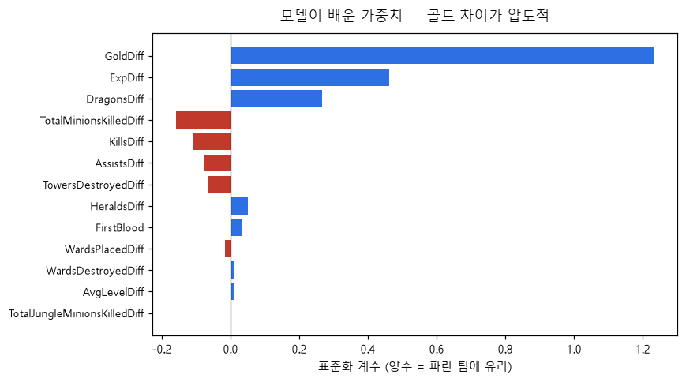

**모델이 실제로 배운 가중치 13개를 전부 펼친 그림입니다.** 오른쪽(파랑)이면 블루에 유리하게,
왼쪽(빨강)이면 불리하게 작용했다는 뜻입니다.

**결과 두 가지가 한눈에 보입니다.**

첫째, **골드 하나가 +1.231로 나머지를 전부 눌러버립니다.** 2위 경험치(+0.461)의 2.7배입니다.
둘째, **빨간 막대가 4개 있습니다** — 미니언·킬·어시스트·타워가 음수입니다.

둘째가 이상합니다. 킬을 많이 한 팀이 불리하다는 말이 되기 때문입니다.
**이 그림 하나가 페이즈 2 전체를 부릅니다.**

**킬은 왜 없나** — 킬만 보면 승패를 잘 가릅니다(13개 중 3위). 그런데 킬을 하면 돈을 받으므로
**킬의 가치가 이미 골드 차이에 들어가 있습니다**(상관 +0.92). 골드를 아는 모델에게 킬은
새로 알려줄 게 없어 가중치가 음수(−0.11)로 나옵니다.
정확한 해석은 **"킬은 돈으로 환산됐을 때만 의미가 있다"** 입니다.

*(왜 이런 일이 생기는지 → [STUDY.md](STUDY.md) **10번 다중공선성** · 두 번째 해석법은 **11번**)*

#### 언제 틀리나

| 10분 골드 차이 | 비중 | 정확도 |
|---|---|---|
| 팽팽함 (1,000 미만) | 34.4% | **0.615** |
| 조금 앞섬 (1,000~2,500) | 36.5% | 0.741 |
| 많이 앞섬 (2,500~4,200) | 20.4% | 0.859 |
| 사실상 결정 (4,200+) | 8.7% | **0.947** |

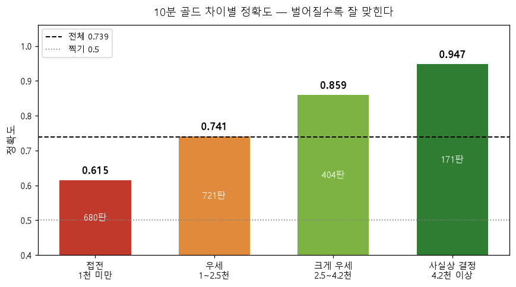

**전체 정확도 하나로 뭉뚱그리면 안 된다**는 것을 보이려고 그린 그림입니다.
막대 안 숫자는 그 구간의 경기 수이고, 검은 점선이 전체 평균(0.739)입니다.

**결과 — 정확도가 구간마다 완전히 다릅니다.** 접전은 0.615인데 사실상 결정 난 경기는 0.947입니다.
**같은 모델인데 구간에 따라 33%p 차이**가 납니다.

**그래서** — 팽팽한 경기를 못 맞히는 건 모델이 부족해서가 아니라 **그 시점 정보에 아직 승패의
단서가 없기 때문**입니다. 맨 앞 승률 곡선에서 ±1,000 구간이 49.5%였던 것과 같은 이야기입니다.
이 한계는 `model_card.md`에 명시했고, 서비스 화면에도 **"지금은 팽팽해서 자주 틀립니다"** 경고가 뜹니다.

#### 경기를 성격별로 묶어보면 (비지도학습)

여기까지는 **"누가 이기나"** 를 물었습니다. 이번엔 정답을 아예 감추고 **"이 판은 어떤 성격의 경기였나"** 를 물었습니다.

**먼저 진영 정보를 지웠습니다.** 그냥 묶으면 "블루 우세 / 레드 우세" 두 덩어리로 갈리는데,
그건 정답을 되비추는 뻔한 결과라 새로 아는 게 없습니다. 그래서 지표 5개를
**절대값과 양 팀 합**으로만 만들었습니다 — 누가 앞서는지는 지우고 **얼마나·어떤 식으로**만 남긴 것입니다.

| 묶는 데 쓴 5개 | 무엇을 재나 |
|---|---|
| 골드차 **절대값** | 얼마나 기울었나 (방향 무시) |
| 양 팀 총 킬 | 싸움이 얼마나 잦았나 |
| 양 팀 총 오브젝트 | 드래곤·전령을 챙겼나 |
| 양 팀 총 와드 | 시야를 얼마나 밝혔나 |
| 양 팀 총 CS | 라인전을 얼마나 챙겼나 |

이 5개로 KMeans를 돌려 **4덩어리**로 묶었습니다.

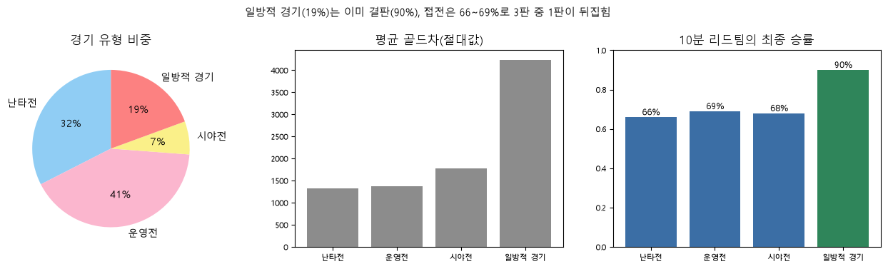

그림 세 장이 나란히 있습니다 — **왼쪽은 유형별 비중, 가운데는 평균 골드차, 오른쪽은 10분 리드팀이 실제로 이긴 비율**입니다.

| 유형 | 비중 | 어떤 경기인가 | 평균 골드차 | 리드팀 최종 승률 |
|---|---|---|---|---|
| **운영전** | 41% | 킬이 적고(9회) CS를 가장 많이 먹음(456). **싸움 없이 조용히 크는 판** | 1,367 | 69% |
| **난타전** | 32% | 킬이 가장 많음(15회). **계속 싸우는 판** | 1,324 | 66% |
| **일방적 경기** | 19% | 골드차가 **3배 이상 벌어진 판** | **4,240** | **90%** |
| **시야전** | 7% | 와드가 119개로 **평균의 3배.** 서로 시야만 재는 판 | 1,784 | 68% |

**결과에서 두 가지가 보입니다.**

**첫째, 난타전과 운영전은 스타일만 다르고 결과는 같습니다.** 킬이 15회냐 9회냐로 정반대인데
골드차(1,324 vs 1,367)도 리드팀 승률(66% vs 69%)도 거의 같습니다.
**싸움을 많이 한다고 격차가 더 벌어지지는 않는다**는 뜻입니다.

**둘째, 일방적 경기만 이미 끝나 있습니다.** 리드팀 승률 90%. 나머지 세 유형은 66~69%라
**3판 중 1판은 뒤집힙니다.**

**그래서** — 오류 분석(구간별 정확도)에서 나온 결론이 **정답을 감춘 방법에서도 똑같이** 나왔습니다.
"10분에 크게 벌어진 판만 결판났고 나머지는 모른다" — 두 방법이 같은 말을 합니다.

※ 4개라는 개수는 지표가 정해준 게 아니라 설명하기 좋아서 고른 값입니다(한계).

#### PCA는 무엇을 보려 했고, 왜 안 썼나

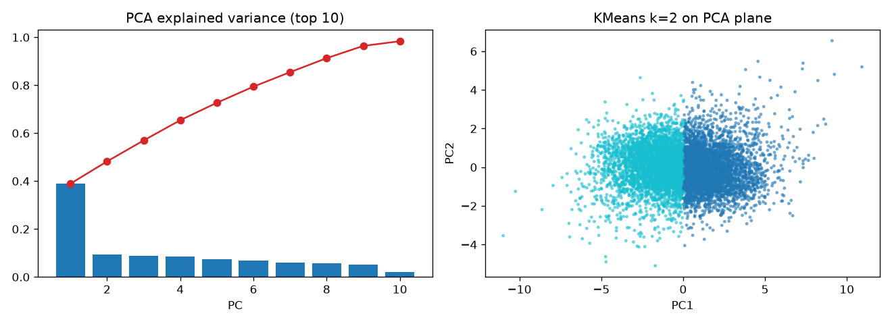

**PCA는 지표 13개를 몇 개로 줄일 수 있는지 재는 도구입니다.**
왼쪽은 "축을 하나씩 더할 때마다 데이터를 얼마나 설명하나", 오른쪽은 그렇게 만든
**가장 중요한 축 두 개(PC1·PC2) 위에 9,879판을 흩뿌리고** 두 덩어리로 묶어본 것입니다.

**결과 — 별로 얻은 게 없었습니다.** 솔직하게 적습니다.

왼쪽에서 **첫 축 하나가 39%**를 설명하는데, 그다음부터는 한 축당 10% 미만으로 뚝 떨어집니다.
"정보가 한 방향에 쏠려 있다"는 뜻이라 여기까지는 쓸 만합니다.
그런데 오른쪽을 보면 **두 덩어리가 PC1의 0을 기준으로 세로로 잘려 있을 뿐**입니다.
결국 **"블루가 앞선 판 / 레드가 앞선 판"** 으로 나눈 것이고, 이건 정답을 그대로 되비춘 것이라 새 정보가 없습니다.

**그래서 이 방향을 접고**, 위에서 한 것처럼 **진영 정보를 지운 5개 지표로 다시 묶었습니다.**
그쪽에서 비로소 운영전·난타전 같은 **"스타일"** 이 나왔습니다.
PCA를 버린 게 아니라, **PCA가 알려준 "정보가 한쪽에 쏠려 있다"는 사실이 다음 선택의 근거**가 됐습니다.

> **그런데 여기서 의심이 남습니다.** 골드가 워낙 세니까 PCA가 안 통한 것 아닐까요?
> 그렇다면 **골드를 빼면 다른 구조가 나와야 합니다.** 이건 페이즈 2에서 직접 확인합니다
> ([2-3 참고](#2-3-그럼-pca가-안-통한-건-골드-탓이었나)).

*(개념이 낯설면 → [STUDY.md](STUDY.md) **12번 PCA · 13번 KMeans**)*

---

<br>

# 페이즈 2 · 골드를 빼고 다시 분석

> **묻는 것** — 골드 의존도가 너무 컸다. 골드를 빼면 무엇이 달라지나?
> **답** — 점수는 0.002밖에 안 떨어지는데, 음수로 눌려 있던 지표 5개가 전부 양수로 살아났다.

## 2-1. 왜 골드를 빼봤나

페이즈 1의 계수 그림에서 **골드 하나가 +1.23으로 나머지를 다 눌러버렸습니다.**
그리고 그 옆에는 이상한 게 있었습니다. **킬은 승패와 분명히 관련 있는데(상관 +0.48) 가중치가 음수(−0.11)** 입니다.
그대로 발표하면 "킬을 하면 진다"는 잘못된 결론이 나옵니다.

원인을 찾으려고 상관 히트맵부터 그렸습니다.


**왼쪽은 지표끼리 얼마나 겹치는지, 오른쪽은 그 겹침이 계수를 어떻게 망가뜨렸는지**입니다.

왼쪽에서 **상관 0.7 이상인 쌍이 8개**인데, **그중 4개가 골드가 낀 쌍**입니다
(킬↔골드 0.918, 골드↔경험치 0.896, 골드↔레벨 0.834, 골드↔어시스트 0.758).
VIF로 봐도 **골드가 23.4로 1위**입니다(10 이상이면 중복으로 봅니다).

오른쪽이 문제의 증거입니다. 가로축은 "이 지표가 승패와 관련 있나", 세로축은 "모델이 준 가중치"입니다.
정상이라면 오른쪽 위나 왼쪽 아래에 모여야 하는데, **오른쪽 아래에 빨간 점 5개**가 있습니다.
**승패와 분명히 관련 있는데(가로축 오른쪽) 가중치는 음수(세로축 아래)** 인 지표들 —
킬·어시스트·미니언·타워·정글 몹입니다.

즉 **골드가 중복의 중심**이었습니다. 킬을 하면 돈을 받고, 미니언을 잡아도 돈을 받고, 타워를 밀어도 돈을 받습니다.
골드는 그 모두를 한 번에 담고 있는 지표라, 모델이 골드에만 가중치를 몰아주고
같은 이야기를 반복하는 나머지 지표에는 **남은 오차를 떠넘겨 음수로 만든 것**입니다.

그래서 **가장 상관이 높은 골드 자체를 빼고 처음부터 다시 학습**했습니다.

## 2-2. 골드를 빼니 무엇이 달라졌나

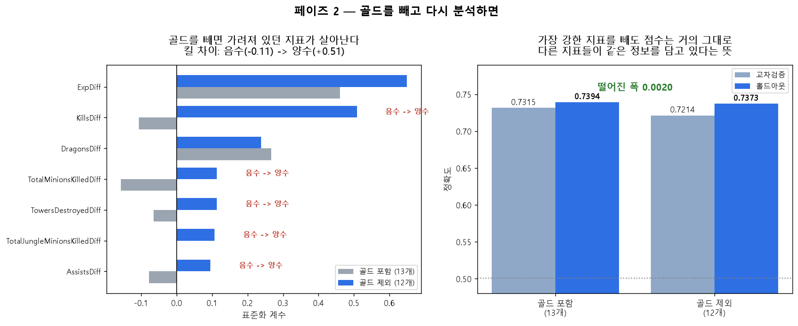

**왼쪽은 계수가 어떻게 바뀌었나, 오른쪽은 그 대가로 점수를 얼마나 잃었나**입니다.
왼쪽에서 회색이 골드를 넣었을 때, 파랑이 뺐을 때입니다. **회색이 왼쪽(음수)인데 파랑은 오른쪽(양수)** 인
지표가 5개 — 빨간 글씨로 표시된 것들입니다.

**첫째, 눌려 있던 지표가 살아났습니다.**

| 지표 | 골드 포함 | 골드 제외 |
|---|---|---|
| **킬 차이** | **−0.107** | **+0.508** |
| 미니언 차이 | −0.157 | +0.114 |
| 어시스트 차이 | −0.079 | +0.096 |
| 타워 차이 | −0.064 | +0.114 |
| 정글 몹 차이 | −0.000 | +0.107 |
| (참고) 경험치 차이 | +0.461 | +0.650 |

**음수로 눌려 있던 5개가 전부 양수로 올라왔습니다.** 킬은 −0.107에서 **+0.508**로, 방향이 바뀌면서 크기도 5배가 됐습니다.
정글 몹은 원래 −0.000(사실상 0)이었는데 +0.107이 됐습니다 — 골드에 가려 아예 목소리가 없던 지표입니다.
즉 **킬이 승패와 무관했던 게 아니라, 골드가 킬의 몫까지 가져갔던 것**입니다. 페이즈 1의 음수 계수는 이걸로 설명됩니다.

**둘째, 점수는 거의 안 떨어졌습니다.**

| 구성 | 지표 수 | 교차검증 | 홀드아웃 | 1위 요인 |
|---|---|---|---|---|
| 전체 13개 | 13 | 0.7315 | **0.7394** | GoldDiff +1.23 |
| **골드 제외** | 12 | 0.7214 | **0.7373** | ExpDiff +0.65 · KillsDiff +0.51 |
| 골드+경험치 제외 | 11 | 0.7197 | 0.7328 | KillsDiff +0.79 |
| 성장 지표 전부 제외 | 7 | 0.6409 | 0.6336 | DragonsDiff +0.37 |

가장 강한 지표를 통째로 뺐는데 **홀드아웃이 0.7394 → 0.7373, 0.002 차이**입니다.
**골드가 특별해서 1위였던 게 아니라, 다른 지표들이 이미 같은 정보를 담고 있어서** 골드가 없어도 대신 채워집니다.

**셋째, 어디까지가 진짜 한계인지도 보였습니다.**
골드·경험치·킬·레벨 같은 **성장 지표를 전부 빼면 0.6336으로 확 떨어집니다.**
드래곤·전령·와드만으로는 안 된다는 뜻이고, **"10분 승패는 결국 성장 격차가 가른다"**는 페이즈 1의 결론이 반대 방향에서도 확인됐습니다.

## 2-3. 그럼 PCA가 안 통한 건 골드 탓이었나

페이즈 1에서 PCA + KMeans가 그냥 "블루 우세 / 레드 우세"로 갈렸습니다.
**골드가 워낙 세서 그런 것 아니냐**는 의심이 자연스럽습니다.
그렇다면 **골드를 빼고 같은 절차를 돌리면 다른 구조가 나와야 합니다.** 확인했습니다.

#### PC1을 무엇이 만드나

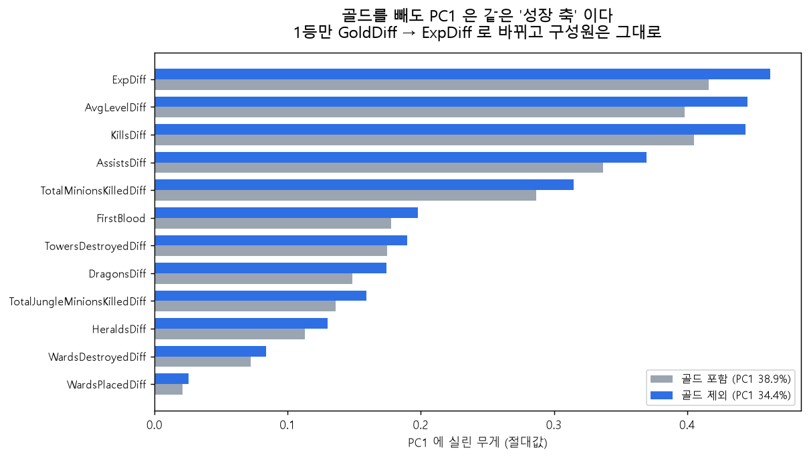

**왜 이걸 봤나** — PC1은 PCA가 찾아낸 "가장 중요한 축"입니다.
그 축을 **어떤 지표들이 만들고 있는지** 보면, 골드가 축을 독차지하고 있었는지 알 수 있습니다.
회색이 골드를 넣었을 때, 파랑이 뺐을 때 각 지표가 PC1에 실린 무게입니다.

**결과 — 1등만 바뀌고 구성원은 그대로입니다.**

| | PC1 설명력 | PC1을 만드는 상위 4개 |
|---|---|---|
| 골드 포함 | 38.9% | GoldDiff · ExpDiff · KillsDiff · AvgLevelDiff |
| 골드 제외 | 34.4% | **ExpDiff** · AvgLevelDiff · KillsDiff · AssistsDiff |

골드가 빠지자 **경험치가 그 자리를 그대로 물려받았습니다.**
축을 만드는 얼굴이 바뀌었을 뿐, **"성장 격차 축"이라는 정체는 똑같습니다.**

#### 군집이 여전히 승패를 되비추나

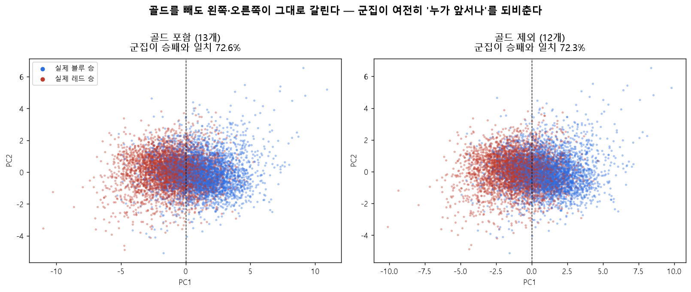

**왜 이걸 봤나** — 페이즈 1의 문제는 군집이 "누가 앞서나"를 그대로 되비춘 것이었습니다.
골드를 빼서 그게 풀렸는지 보려면, **같은 그림을 나란히 놓고 비교**하면 됩니다.
점 하나가 경기 한 판이고, 파랑은 실제로 블루가 이긴 판, 빨강은 진 판입니다.

**결과 — 두 그림이 사실상 같습니다.** 골드를 빼도 **여전히 PC1의 0을 기준으로 빨강과 파랑이 좌우로 갈립니다.**
군집이 승패와 일치하는 비율도 **72.6% → 72.3%** 로 거의 그대로입니다.

#### 그래서 무엇을 알게 됐나

**PCA가 안 통한 건 골드 탓이 아니었습니다.**

골드 하나가 문제였다면 빼는 순간 다른 구조가 드러났어야 합니다. 그런데 안 드러났습니다.
이유는 **성장 지표 6개가 애초에 한 덩어리로 같은 방향을 가리키기 때문**입니다.
골드를 빼면 경험치가, 경험치까지 빼면 킬이 같은 역할을 대신합니다.

**이건 2-2에서 나온 결론과 정확히 같은 이야기입니다.**
골드를 빼도 정확도가 0.002밖에 안 떨어진 이유도, PCA 구조가 안 바뀐 이유도 하나입니다 —
**빼야 할 것은 지표 하나가 아니라 "성장 격차"라는 정보 자체인데, 그건 뺄 수가 없습니다.**
그것이 10분 데이터가 가진 정보의 거의 전부이기 때문입니다.

**그래서 지표를 하나씩 빼고 넣는 방향은 여기서 끝**입니다. 다음 페이즈에서는 각도를 바꿔
**차원 자체를 줄여보고(데이터 축소), 승패 말고 다른 구조를 찾아보고(군집화), 모델도 바꿔봅니다.**

```bash
python src/phase2_pca.py     # 위 두 그림을 다시 생성
```

## 2-4. 그래서 어떻게 하기로 했나

**최종 모델은 13개를 그대로 씁니다.** 점수가 더 높고, 드래곤·전령 같은 지표를 순위표에 남겨야 하기 때문입니다.

**대신 계수를 그대로 읽지 않습니다.** 사용자 화면에는 **효과크기 순위**를 쓰고,
계수는 "다른 지표를 고려한 뒤 남은 몫"이라는 설명과 함께만 제시합니다.
"킬 계수가 왜 음수냐"는 질문에는 위의 표를 보여주면 됩니다 — **골드를 빼면 +0.508입니다.**

여기까지가 **10분 시점 안에서 할 수 있는 것의 끝**입니다. 지표를 빼도 점수가 거의 안 변합니다.
**10분 정보량 자체가 상한**이라는 뜻이고, 그래서 다음은 지표가 아니라 **시점**을 바꿔봐야 합니다.

---

<br>

# 페이즈 3 · 군집화와 데이터 축소

> **묻는 것** — 0.73이 정말 한계인가? 차원을 줄이면, 다르게 묶으면, 모델을 바꾸면 달라지나?
> **답** — 셋 다 해봤고 셋 다 그대로. 상한은 모델이 아니라 10분 정보량이다.

페이즈 2에서 "정보가 성장 축 하나에 몰려 있다"고 결론냈습니다. 발표 비평에서도
**"군집화와 데이터 축소를 고려하라"**는 지적을 받았습니다. 그래서 세 가지를 정식으로 확인했습니다.
여기서도 **전부 학습셋 7,903판만** 씁니다 — 시험지는 계속 봉인입니다.

## 3-1. 데이터 축소 — 정말 축 몇 개면 되나

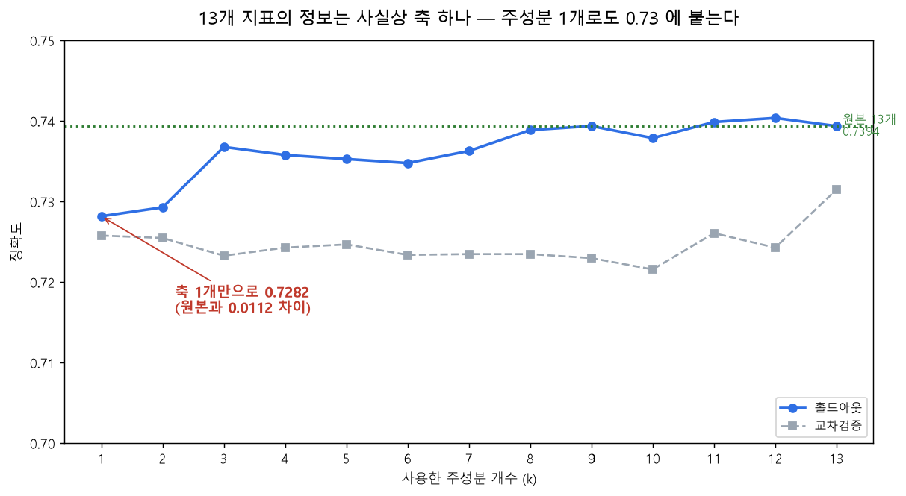

**왜 이걸 봤나** — 페이즈 2의 "정보가 한 축"이라는 말을 숫자로 증명하려면,
**실제로 축 k개만 남기고 다시 학습**해보면 됩니다. PCA로 13개를 주성분 k개로 줄이고
같은 로지스틱을 다시 학습해 k를 1부터 13까지 훑었습니다.

**결과 — 축 1개만으로 0.7282입니다.** 원본 13개(0.7394)와 **0.011 차이**입니다.
분할을 10번 바꿔도 0.7219 ± 0.0062로 안정적이었습니다.
곡선이 k=1에서 이미 평평합니다 — 축을 더해도 거의 안 오릅니다.

**그래서** — "13개 지표의 정보는 사실상 성장 격차 축 하나"가 정량으로 확인됐습니다.
다만 **서비스는 13개를 유지**합니다. 주성분에는 이름이 없어서
"PC1이 +0.8이라 유리합니다"로는 아무도 설득할 수 없기 때문입니다.
축소가 *가능*하다는 것과 *유익*하다는 것은 다릅니다 — 우리 기능은 "왜"를 설명하는 것이니까요.

## 3-2. 군집화 — 묶는 모델부터 겨루고 채택

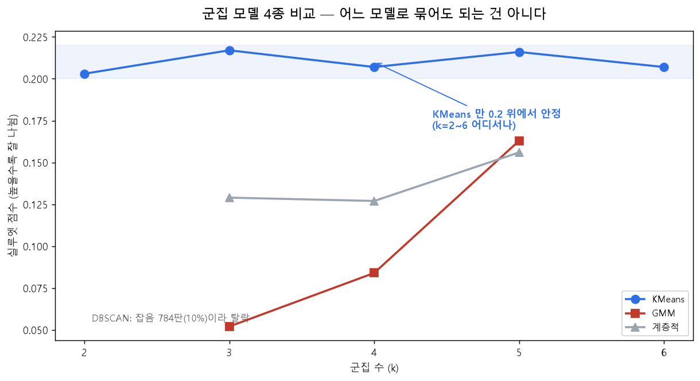

**왜 이걸 봤나** — 페이즈 1의 경기 유형 4가지는 KMeans로 묶었는데,
**KMeans를 다른 군집 모델과 비교한 적은 없었습니다.** 예측 모델은 8종을 겨루고 뽑았으면서
군집 모델은 그냥 쓴 셈이라, 4종(KMeans · GMM · 계층적 · DBSCAN)을 같은 조건에서 겨뤘습니다.

**결과 — KMeans의 완승입니다.** 실루엣 점수(잘 나뉜 정도)가 유일하게 0.2 위이고,
계층적과 **같은 4,000표본에서 5번 재대결해 5번 다 이겼습니다.**
GMM은 경계가 흐리고(0.05~0.17), DBSCAN은 경기의 **10%를 "잡음"으로 버려서** 탈락입니다 —
경기 데이터는 밀도 경계가 없이 연속적이라 밀도 기반이 안 맞습니다.

**그래서 KMeans를 정식 채택합니다.** 근거는 세 가지 — 점수 1위, **중심이 평균값이라
"운영전 = 킬 9회·CS 456" 같은 표로 해석 가능**, 그리고 시드를 바꿔도 유형 배정이
**99.2~99.9% 재현**됩니다. k=4는 실루엣이 2~6 어디서나 비슷해(0.20~0.22) 숫자가
정해주지 못했고, **설명하기 좋아서 고른 값**이라는 한계는 그대로 유지합니다.

*(실루엣이 뭔지 → [STUDY.md](STUDY.md) **13번 KMeans**)*

## 3-3. 모델 추가 학습 — 나이브베이즈는 왜 탈락했나

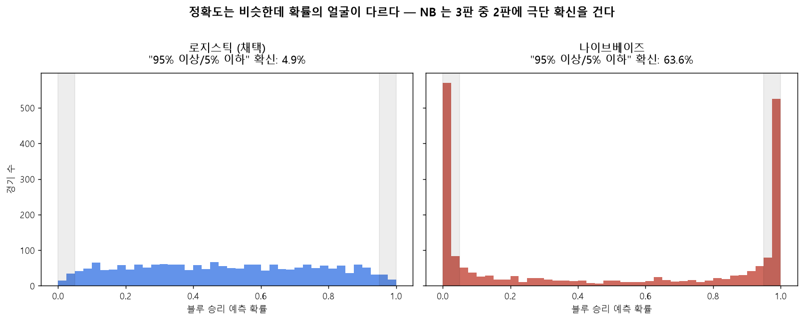

**왜 이걸 봤나** — 페이즈 1 비교에서 나이브베이즈가 **로지스틱 다음으로 적합**했습니다
(3위 0.7238, 격차 +0.0015로 전혀 안 외움). 후보를 하나 더 제대로 학습해서
로지스틱과 무엇이 다른지 봤습니다.

**결과 — 정확도는 대등한데 확률의 얼굴이 완전히 다릅니다.**

| | 정확도 | AUC | Brier | "95% 이상/5% 이하" 확신 |
|---|---|---|---|---|
| 로지스틱 (채택) | 0.7394 | 0.8150 | **0.1756** | **4.9%** |
| 나이브베이즈 | 0.7313 | 0.8096 | 0.2179 | **63.6%** |

왼쪽 그림(로지스틱)은 확률이 고르게 퍼져 있는데, 오른쪽(NB)은 **0과 1 양끝에 쌓여 있습니다.**
NB는 경기 3판 중 2판에 "95% 이상 확신"을 겁니다 — 팽팽한 접전에도요.

**왜 이런 일이 생기나** — NB는 "지표끼리 서로 독립"이라 가정하고 확률을 **곱해** 나갑니다.
그런데 우리 지표는 상관 0.9로 얽혀 있어서(페이즈 2), 사실상 **같은 증거를 여섯 번 세는 셈**입니다.
같은 증거를 거듭 곱하니 51%짜리 확신이 99%로 부풀어 오릅니다.

**그래서** — 분할을 10번 바꿔도 로지스틱이 **10번 다 이겼고**(평균 +0.009),
우리 서비스는 확률을 화면에 그대로 보여주므로 NB는 서비스 모델로는 탈락입니다.
다만 "누가 이기나"는 비슷하게 맞히므로 **교차 확인용 보조 모델**로는 값어치가 있습니다.

## 3-4. 페이즈 3이 확정한 것

차원을 줄여도(3-1), 묶는 모델을 바꿔도(3-2), 예측 모델을 바꿔도(3-3) **0.73 언저리는 그대로**입니다.
페이즈 2의 결론이 세 방향에서 다시 확인됐습니다 — **상한은 모델이 아니라 10분 정보량입니다.**

그렇다면 남은 수는 하나뿐입니다. **10분이라는 시점 자체를 바꾸는 것** — 페이즈 4입니다.

```bash
python src/phase3_cluster_reduce.py     # 위 세 실험을 다시 실행
```

---

<br>

# 페이즈 4 · 시점 비교 (10분 vs 15분)

> **묻는 것** — 5분을 더 보면 무엇이 달라지나?
> **답** — 전체로는 +5.25%p. 단, 그 이득은 팽팽한 경기에만 몰려 있다.

페이즈 2에서 **가장 강한 지표를 빼도 점수가 0.002밖에 안 떨어진다**는 것을 확인했습니다.
지표를 어떻게 조합해도 10분 안에서는 0.73 언저리가 상한이라는 뜻입니다.
그렇다면 남은 방법은 하나뿐입니다 — **10분이라는 시점 자체를 바꿔보는 것.**

프로 경기 데이터로 **시점만** 바꿔 비교했습니다.

**모델은 페이즈 1과 같은 로지스틱 회귀입니다**(StandardScaler → LogisticRegression, 시드 42).
10분용 모델과 15분용 모델을 **따로 학습해서 점수를 나란히 놓는** 방식입니다.

공정하게 재려면 시점 말고는 전부 같아야 하므로 이렇게 묶었습니다.

| 고정한 것 | 어떻게 |
|---|---|
| 같은 경기 | 10분·15분 기록이 **둘 다 있는 경기 10,656판**만 사용 |
| 한 경기 = 한 줄 | 원본은 한 경기가 블루·레드 두 줄이라, 그대로 쓰면 같은 경기가 학습·시험 양쪽에 들어갑니다. 블루 줄만 남겼습니다 |
| 같은 지표 | 두 시점에 똑같이 존재하는 **5개만** (골드·경험치·CS·킬·어시스트) |
| 같은 분할·모델·시드 | 두 시점이 같은 학습/시험 인덱스, 같은 5조각 교차검증, 시드 42 |

지표가 13개가 아니라 5개인 이유는 이 데이터의 드래곤·전령·타워가 **경기 전체 누적값**이라
"10분 시점의 값"이 없기 때문입니다. 넣으면 미래 정보를 미리 보는 셈이라 뺐습니다.

이렇게 시점 외 모든 조건을 묶었기 때문에, 점수 차이를 **"5분을 더 봐서 생긴 차이"** 라고 말할 수 있습니다.
반대로 **이 숫자를 페이즈 1의 0.7394와 비교하면 안 됩니다** — 데이터(프로 vs 다이아)도 지표 수도 다릅니다.
여기서는 10분과 15분끼리만 비교합니다.

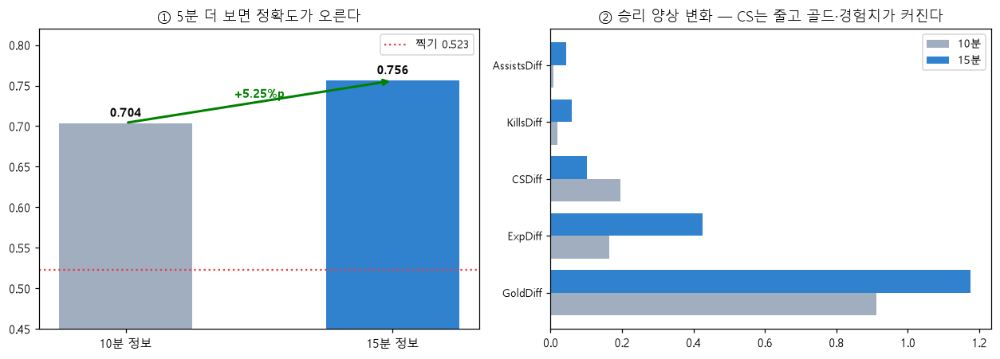

**왼쪽은 점수가 얼마나 올랐나, 오른쪽은 무엇이 중요해졌나**입니다.

왼쪽 — **0.704 → 0.756, +5.25%p** 올랐습니다. 빨간 점선(찍기 0.523)과 견주면 확실한 상승입니다.
5분을 더 보는 것이 실제로 도움이 된다는 뜻입니다.

오른쪽 — 회색이 10분, 파랑이 15분에 각 지표가 받은 가중치입니다. **골드가 0.91 → 1.18로 더 커지고,
경험치도 0.17 → 0.43으로 커집니다.** 반대로 **CS는 0.20 → 0.10으로 줄어듭니다.**
라인전에서 미니언을 챙기는 단계가 지나고 **격차 자체가 승패를 말하는 단계로 넘어간다**는 뜻입니다.

그런데 전체 평균만 보면 중요한 걸 놓칩니다. 10분 상황별로 쪼개보면 이렇습니다.

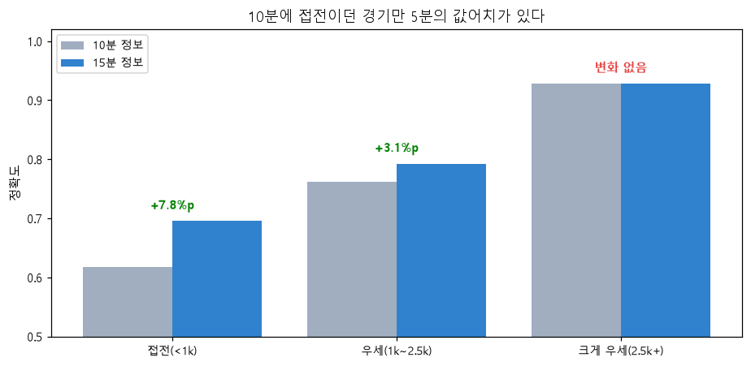

**10분에 어떤 상황이었느냐로 나눠, 5분을 더 봤을 때 얼마나 나아지는지 잰 그림입니다.**

| 10분 상황 | 비중 | 10분 정보 | 15분 정보 | 개선 |
|---|---|---|---|---|
| **팽팽함 (1,000 미만)** | 52.1% | 0.617 | 0.696 | **+7.8%p** |
| 조금 앞섬 | 37.5% | 0.761 | 0.793 | +3.1%p |
| 많이 앞섬 (2,500+) | 10.4% | 0.928 | 0.928 | **±0.0%p** |

**결과 — 이득이 한쪽에만 몰려 있습니다.**
이미 크게 벌어진 경기는 **5분을 더 봐도 0.928 그대로, 변화가 정확히 0입니다.**
반면 팽팽한 경기는 +7.8%p 오릅니다.

**왜 그런가** — 10분에 팽팽했던 경기의 **59%가 그 5분 사이에 한쪽으로 기울기** 때문입니다.
이미 결판난 경기는 더 볼 것이 없고, **아직 안 갈린 경기에서만 새 정보가 생깁니다.**

**그래서 "5분 더 보면 좋다"가 아니라 "팽팽할 때만 5분이 값어치가 있다"** 가 정확한 결론입니다.

**제목의 답** — 경기의 약 10%는 10분에 이미 끝나 있고, 절반쯤 되는 팽팽한 경기는
그 6할이 10~15분에 갈립니다. "초반에 다 기운다"도 "끝까지 모른다"도 둘 다 틀렸습니다.

---

# 서비스

**https://p4.sumzip.com** — 숫자를 넣으면 승률과 이유가 나옵니다. 예시 버튼 3개로 바로 확인할 수 있습니다.

## 화면의 숫자는 어디서 나오나

```
브라우저 → web/frontend.py (9504) → web/app.py (9524) → lolwin.predict → artifacts/model.joblib
            화면·중계만              예측 API            예측 전담        학습된 모델 (2.2KB)
```

**각 계층이 무엇을 import 하는지**가 곧 "누가 계산하는가"입니다.

| 파일 | import 하는 것 | 하는 일 |
|---|---|---|
| `web/frontend.py` | `flask` · `urllib` | 화면을 내려주고 `/api/*`를 백엔드로 **중계만**. 예측 코드 0줄 |
| `web/app.py` | `flask` · **`from lolwin import predict`** | 입력을 받아 `predict()`에 넘기고 결과를 JSON으로 반환 |
| `lolwin/predict.py` | **`joblib` · `pandas` · `numpy`** | 모델을 불러 확률과 승리요인을 계산 — **계산은 이 파일뿐** |
| `predict.py` (루트) | `from lolwin.predict import …` | 명령행·기존 코드용 호환 진입점. 계산 없음 |

**`web/` 어디에도 `sklearn`·`joblib` import가 없습니다.** 웹은 계산하지 않고 `predict()`를 부를 뿐입니다.
계산이 두 곳에 있으면 화면 확률과 모델 확률이 갈라져도 아무도 모르기 때문입니다.

### model.joblib 안에는 무엇이 들어 있나

```
Pipeline
 ├─ scaler → StandardScaler      평균 13개 · 표준편차 13개
 └─ model  → LogisticRegression  계수 13개 + 절편 −0.0043
```

**딱 이게 전부입니다(2,209 bytes).** 파이프라인을 통째로 저장했기 때문에
예측할 때 **표준화를 빠뜨릴 수가 없습니다.** 스케일러와 회귀식이 한 덩어리로 묶여 있어서입니다.

### 계산이 실제로 무슨 일을 하는지

`predict()`가 하는 계산은 세 줄로 끝납니다.

```python
z    = (입력값 - scaler.mean_) / scaler.scale_   # ① 표준화
로짓  = coef_ @ z + intercept_                    # ② 계수를 곱해 더한다
확률  = 1 / (1 + exp(-로짓))                      # ③ 0~1 로 눌러 담는다
```

같은 입력(골드 +2,000 등)을 **손으로 계산한 값과 sklearn이 낸 값이 소수점 아래까지 같은지** 확인했습니다.

| 방법 | 결과 |
|---|---|
| 손계산 (①②③ 직접) | 0.818255 |
| `model.predict_proba` | 0.818255 |
| **라이브 `p4.sumzip.com`** | **0.8183** |

**셋이 일치합니다.** 화면에 뜨는 숫자가 학습된 모델이 낸 숫자 그대로라는 뜻입니다.
`web/test_parity.py`가 이 검증을 자동으로 돌립니다.

**"골드차가 크면 승리" 같은 사람이 만든 규칙은 한 줄도 없습니다.** 넣는 순간
"데이터가 검증했다"는 말이 거짓이 되기 때문입니다.

### 승리요인은 어떻게 뽑나

화면의 "이유"는 **계수 × 표준화값(z)** 입니다. 그 판에서 각 지표가 로짓을 얼마나 밀었는지를
그대로 분해한 값이라, 확률과 따로 노는 별도 계산이 아닙니다.

다만 이 기여도는 **다른 지표를 통제한 뒤의 몫**이라, 킬은 음수로 나올 수 있습니다
(페이즈 2 참고). 그래서 화면에는 이 설명을 함께 띄웁니다.

**"골드차가 크면 승리" 같은 사람이 만든 규칙은 한 줄도 없습니다.** 넣는 순간
"데이터가 검증했다"는 말이 거짓이 되기 때문입니다.

## 상업화를 가정해 본다면

실제로 상업화할 계획은 없지만, **상품이라고 가정하고** 사업성을 따져봤습니다.

**누구에게 무엇을 파는가** — 시중 중계 화면에도 승률 그래프는 이미 뜹니다. 그래서 숫자 자체는 상품이 못 됩니다.
우리가 다르게 주는 것은 **"왜"와 "언제 믿으면 안 되는지"**입니다.
게임을 잘 모르는 관전자에게는 "지금 골드 격차 때문에 파란 팀이 유리하다"는 **관전 포인트**를,
복기하려는 게이머에게는 "그 싸움이 돈 격차로 이어졌는가"라는 **복기 우선순위**를 줍니다.

**대체 불가성은 어디서 오나** — 접전 정확도가 0.615라서 이건 "맞히는 상품"으로는 팔 수 없습니다.
오히려 그 한계를 화면에 그대로 보여주는 것("지금은 팽팽해서 자주 틀립니다")이 차별점입니다.
근거를 감춘 승률 그래프는 많지만, **근거와 한계를 같이 파는 서비스는 드뭅니다.**

**수익 모델 후보** — ① 스트리머·소규모 중계용 오버레이 구독 ② 경기 후 복기 리포트
③ 지표·설명을 돌려주는 API. 셋 다 "예측"이 아니라 **"설명"을 파는** 모델입니다.

**정직하게 적는 리스크** — 라이엇 IP·API의 상업 이용은 별도 허가가 필요하고,
실시간 경기 데이터는 API로 제공되지 않아 **끝난 경기 복기만 가능**합니다.
패치마다 재학습이 필요하고, 지금 모델은 다이아 티어·특정 패치에 한정됩니다.
이 넷 중 하나라도 풀지 못하면 상품이 아니라 데모입니다 — 그래서 "가정"입니다.

```bash
./check_project.sh start | stop | restart | status | logs
```

---

# 재현 방법

```bash
pip install -r requirements.txt          # Python 3.11 · scikit-learn 1.9.0

pip install -e .                         # 한 번만 — 노트북·다른 폴더에서 lolwin 을 쓰려면 (서비스 자체는 없어도 뜸)
python src/day1_baseline.py              # 데이터 확인 · 분할 · 찍기 점수 0.5009
python src/split_check.py                # 분할 진단 (겹침·층화·분포 4항목)
python src/day2_features_cluster.py      # 중복 정리 · 차이 지표 13개 · 군집
python src/day2b_game_types.py           # 경기 유형 4가지 (viz_3_game_types.png)
python src/finalize_model.py             # 최종 학습 · 채점 0.7394 · 모델 저장
python src/model_choice_viz.py           # 왜 이 모델인가 (06_model_choice.png)
python src/feature_reduction.py          # 페이즈 2 — 히트맵 확인 후 골드 빼고 재학습
python src/phase2_pca.py                 # 페이즈 2 — PCA 가 골드 탓이었는지 확인
python src/phase3_cluster_reduce.py      # 페이즈 3 — 축소·군집 비교·나이브베이즈
python src/timepoint_compare.py          # 페이즈 4 — 10분 vs 15분
python src/repeat_check.py               # 분할을 10번 바꿔 재학습
python predict.py --demo                 # 예측 확인 (51.2% / 94.6% / 16.8%)
python src/factcheck.py                  # 문서 숫자 자동 점검 (0건이어야 정상)
./check_project.sh verify                # 위 검사 + 예측 회귀 · 서빙 계약 · 학습 재현성
```

데이터 CSV는 저작권·용량 때문에 저장소에 없습니다. `data/README.md`의 링크에서 받으세요.
DB 접속 정보가 없으면 자동으로 로컬 CSV를 씁니다(계산식 동일).

**재현성 규약 8항목** — 시드 42 · 분할 파일 저장 · 절대경로 금지 · 버전 고정 · 순차 실행 ·
전처리는 Pipeline 안 · 실험 기록 `runs.csv` · **행 정렬 고정(`gameId`)**

마지막 항목은 직접 겪고 추가했습니다. 시드를 고정해도 **읽는 순서가 다르면 분할이 달라집니다.**

*(왜 이런 일이 생기는지 → [STUDY.md](STUDY.md) **14번 재현성**)*

---

# 무엇이 어디에 있나

## 사람이 봐야 하는 것 — 이 네 개면 충분합니다

| 폴더·파일 | 역할 | 언제 보나 |
|---|---|---|
| **`README.md`** | 프로젝트 전체 이야기 (이 파일) | 처음 볼 때 · 발표 준비할 때 |
| **`STUDY.md`** | 개념 가이드 — "왜 이걸 하는데?"부터 시작 | 용어가 막힐 때 |
| **`reports/`** | **결과물이 모이는 곳.** 제출용 노트북 · 발표용 지표표 · 그림 | 제출·발표 자료가 필요할 때 |
| **`model_card.md`** | 모델 사용설명서와 **금지 상황** | 남에게 모델을 넘길 때 |

`reports/` 안에서 실제로 열어볼 것은 세 개입니다.

| 파일 | 무엇 |
|---|---|
| `model_report.ipynb` | **제출용** — 채택 모델 · 뷰·분할 상태 · 평가 결과 · 혼동행렬 |
| `metrics_summary.md` | **발표용** — 숫자와 근거 파일, 예상 질문 5개의 답 |
| `phase2_feature_reduction.md` | 페이즈 2 상세 (골드 제외 실험) |

나머지 `reports/figures/` `reports/tables/` 는 그림·표 원본 보관소라 **직접 열 일이 없습니다.**

## 나머지 — 기계가 검증하는 것들

한 줄씩만 알아두면 됩니다. 고칠 일이 생기면 검사가 잡아줍니다.

```
lolwin/        라이브러리 — 피처 정의·모델·예측이 여기 모여 있다 (정본)
predict.py     명령행 진입점 (실제 로직은 lolwin 안)
artifacts/     학습된 모델 파일 + 입력 규격
tests/         회귀·계약·재현성 검사
src/           분석 실험 스크립트 (페이즈 1·2·3 재현)
web/           프론트(9504) · 백엔드(9524)
notebooks/     전 과정 재현 노트북
docs/          기획·명세·계획·배포·서빙 계약
db/            DB 적재와 SQL 뷰
data/          원본 CSV(저장소에 없음) + 분할 인덱스 — 재현성 규약의 실물
specs/         팀 서버 정본 명세 (서버에서 git pull 로 갱신 — 편집 금지)
```

무엇을 고치든 이 한 줄이면 전부 확인됩니다.

```bash
./check_project.sh verify     # 예측 회귀 · 서빙 계약 · 학습 재현성 · 문서 수치
```

**산출물 6종** — README · 재현 노트북 · `model.joblib` · `schema.json` · `predict.py` · `model_card.md`

---

# 한계

- **팽팽한 경기는 10분 정보로 못 맞힙니다.** 모델이 아니라 정보량의 한계입니다.
- **수집 시점 패치·다이아 티어에 한정**됩니다. 게임이 바뀌면 다시 학습해야 합니다.
- **10분 vs 15분은 프로 경기 결과**라 일반 랭크에 그대로 적용할 수 없습니다.
  같은 팀의 경기가 학습·시험 양쪽에 들어가 절대 수치는 좋게 나왔을 수 있습니다(두 시점 간 차이 비교는 유효).
- **경기 유형 4개는 지표가 정해준 값이 아니라** 설명하기 좋아서 고른 구획입니다.
- **정성 스모크 테스트(SC-7)** 는 1명에게 실행했습니다(3문항 중 2개 정답). 킬을 오해한 오답을 근거로 부록에 킬 설명을 보탰지만, 보완본으로 재확인하지는 못했습니다.
- 확률 자체가 얼마나 정확한지(캘리브레이션)는 검증하지 않았습니다.

---

# 부록 — 관전 포인트 (게임을 몰라도 이것만)

1. **골드(돈) 차이** — 4,200 이상이면 사실상 결정(적중률 95%), 1,000 미만이면 이제 시작(적중률 62%)
2. **경험치(레벨) 차이** — 돈과 별개로 레벨이 앞서면 유리
3. **드래곤** — 팀 전체가 강해지는 버프

**킬은 왜 목록에 없나** — 킬을 많이 했어도 **돈 차이가 안 벌어졌다면 아직 유리한 게 아닙니다.**
킬을 하면 돈을 받기 때문에, 킬의 가치는 이미 돈 차이 안에 들어가 있습니다.
그래서 "킬 몇 개 앞섰나"가 아니라 **"그 싸움이 돈 격차로 이어졌나"** 를 봐야 합니다.

**한 줄 요약 — 골드차 4천이면 끝난 경기, 1천 미만이면 이제 시작입니다. 킬은 돈으로 바뀌었을 때만 의미가 있습니다.**
