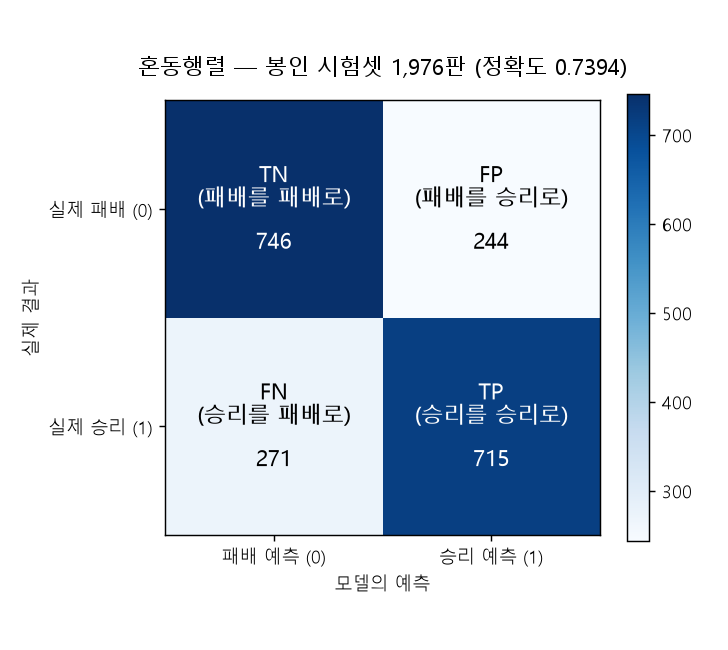
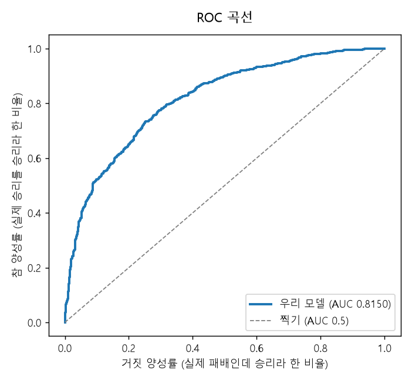

# 모델 평가 보고서 — 4조

**주제**: LoL 경기는 언제 승부가 결정되는가 — 인게임 시점별 경기 데이터 기반 승패 예측 및 핵심 승리요인 분석
**제출일**: 2026-09-01 · **재현 방법**: `python src/finalize_model.py` (아래 모든 수치가 그대로 나옵니다)

---

## 1. 채택한 모델

### 무엇을 쓰나

**로지스틱 회귀** (`StandardScaler` + `LogisticRegression`, 전처리까지 한 덩어리로 저장)

경기 10분 시점의 상황 13개 숫자를 넣으면 **파란 팀이 이길 확률**을 돌려줍니다.
확률이 0.5 이상이면 승리, 미만이면 패배로 판정합니다.

### 어떻게 계산하나

두 단계입니다.

1. 각 지표에 가중치를 곱해 모두 더합니다 → `z = w₁x₁ + w₂x₂ + … + b` (일종의 종합 점수)
2. 그 점수를 0~1 사이 확률로 바꿉니다 → `1 / (1 + e^(-z))` (S자 모양 곡선)

**이 가중치가 곧 해석입니다.** 값이 양수면 그 지표가 클수록 파란 팀에 유리하다는 뜻이고,
크기가 클수록 승패에 크게 작용합니다. 아래 3-3의 승리요인 순위가 여기서 나옵니다.

### 왜 이 모델인가 — 8종을 같은 조건에서 비교한 결과

같은 데이터·같은 시드(42)·5조각 교차검증으로 후보 8개를 붙여봤습니다.

| 순위 | 모델 | 교차검증 정확도 | 연습−검증 격차 | 판정 |
|---|---|---|---|---|
| **1** | **로지스틱 회귀** | **0.7280 ± 0.0163** | **+0.0039** | ✅ **채택** |
| 2 | 랜덤포레스트 | 0.7248 | +0.2752 (연습 1.0000) | ❌ 통째로 외움 |
| 3 | GaussianNB | 0.7238 | +0.0015 | 통과했으나 2위 이하 |
| 4 | SVM (RBF) | 0.7223 | +0.0391 | ❌ 기준 초과 |
| 5 | 결정트리 (깊이 4) | 0.7180 | +0.0105 | 통과했으나 하위 |
| 6 | KNN (k=25) | 0.7147 | +0.0206 | 통과했으나 하위 |
| 7 | HistGradientBoosting | 0.7140 | +0.1387 | ❌ 기준 초과 |
| — | 찍기(DummyClassifier) | 0.5009 | 0.0000 | 기준선 |

**성능이 모델 복잡도의 정확히 역순이었습니다.** 가장 단순한 로지스틱이 1등입니다.

- **랜덤포레스트를 버린 이유**: 연습 점수가 1.0000(만점)입니다. 잘한 게 아니라 연습 문제를 통째로 외운 것이고,
  처음 보는 문제에서는 0.7248로 떨어집니다. 이 격차 0.2752는 허용 기준(0.03)의 9배입니다.
- **로지스틱을 고른 이유 세 가지**: ① 점수 1위 ② 외우지 않음(격차 +0.0039)
  ③ **가중치로 "왜 그렇게 예측했는지" 설명 가능** — 이 프로젝트의 목표가 "왜까지 설명"이라 이게 결정적이었습니다.

### 왜 더 손보지 않았나 (튜닝 생략의 근거)

| 넣은 지표 | 정확도 |
|---|---|
| 골드 차이 1개만 | 0.7313 |
| 골드 차이 + 경험치 차이 2개 | **0.7328** |
| 전체 (당시 29개) | 0.7303 |

**지표 2개가 전체와 거의 같습니다.** 정보가 두 지표에 몰려 있어서 하이퍼파라미터를 조정해도
짜낼 것이 없다고 판단하고, 남은 시간을 해석과 문서에 썼습니다.

### 판정 기준값

확률 0.40~0.60을 훑어본 결과 0.45~0.50 구간이 평평했고, 승패 오답의 손해가 서로 같아서(비용 대칭)
**기본값 0.5를 그대로** 씁니다. "조정이 필요 없음을 확인한 것" 자체가 결과입니다.

---

## 2. 학습/테스트 데이터 뷰와 분할 상태

### 2-1. 원천 데이터

| 항목 | 내용 |
|---|---|
| 출처 | [Kaggle — LoL Diamond Ranked Games (10 min)](https://www.kaggle.com/datasets/bobbyscience/league-of-legends-diamond-ranked-games-10-min) |
| 적재 위치 | 팀 MariaDB `lol_matches_10min` (접속 정보는 DDBM 사이트 참고) |
| 규모 | **9,879행 × 40컬럼** — 한 행이 경기 한 판 |
| 결측 / 중복 | **0건 / 0건** (전수 확인) |
| 정답 컬럼 | `blueWins` — 파란 팀 승리 1 / 패배 0 |
| 정답 비율 | 패 4,949 (50.10%) / 승 4,930 (49.90%) — **거의 정확히 반반** |

정답이 반반이라는 사실이 중요합니다. 한쪽으로 치우쳐 있었다면 정확도가 속기 쉬운 지표라
F1으로 바꿔야 했는데, 균형이라 **정확도를 1순위 지표로 쓰는 것이 정당**합니다.

### 2-2. 분할 상태

| 구분 | 경기 수 | 비율 | 승리 비율 |
|---|---|---|---|
| **학습(train)** | **7,903** | 80% | 49.90% |
| **시험(test)** | **1,976** | 20% | 49.90% |
| 겹침 | **0건** | | |

- **층화 분할**(`stratify=y`)이라 양쪽의 승패 비율이 원본과 같게 유지됩니다.
- 시드 42로 고정하고, 분할 결과를 `data/splits/train_idx.csv` · `test_idx.csv`에 **파일로 저장**했습니다.
  누가 언제 돌려도 같은 시험지를 씁니다.
- DB에는 `ml_split` 테이블로 같은 분할이 고정되어 있습니다.

**가장 중요한 규칙 — 분할이 먼저입니다.** 어떤 전처리보다 먼저 나누고 시험셋을 봉인했습니다.
전처리를 먼저 하면 시험 데이터의 통계가 학습에 섞여 들어가 점수가 가짜로 오릅니다(누수).
오류가 나지 않아서 모르고 지나가기 가장 쉬운 실수입니다.

시험셋은 **모델·지표 선택에 일절 쓰지 않았고**, 최종 채점과 해석에만 사용했습니다.

### 2-3. 뷰(View) 구성

피처 계산식은 **SQL 뷰 한 곳에만** 두고 파이썬은 읽기만 합니다.
계산식이 두 곳에 있으면 서로 갈라져도 아무도 모르기 때문입니다. (정의: `db/create_ml_views.sql`)

```
lol_matches_10min ─┬─ ml_split (분할 고정)
                   └─→ v_base ─→ v_diff13_all ─┬─ v_diff13_train  (7,903행)
                                                └─ v_diff13_test   (1,976행)
```

| 뷰 이름 | 지표 수 | 용도 | 상태 |
|---|---|---|---|
| **`v_diff13_train` / `_test`** | **13** | **현재 채택** — 학습·평가에 사용 | ✅ 정본 |
| `v_clean27_train` / `_test` | 27 | 중복만 제거한 대조군 (차이 변환 효과 측정용) | 비교용 |
| `v_gold2_train` / `_test` | 2 | 골드차+경험치차만 (최소 구성 기준선) | 비교용 |
| `v_cluster5_train` / `_test` | 5 | 경기 유형 분류 전용 (정답 없음, 비지도) | 예측에 미사용 |

> **뷰가 4종이라고 모델이 4개인 것이 아닙니다.** 예측 모델은 로지스틱 회귀 하나이고,
> 그 하나에 넣을 재료 묶음을 바꿔 비교한 것입니다.

**학습에는 `_train` 뷰만** 씁니다. `_test`는 최종 채점에서 한 번만 엽니다.

### 2-4. 지표 13개는 어떻게 만들었나

원본 38개 후보 중 **11개가 중복**이었습니다.

| 중복 유형 | 예 |
|---|---|
| 거울 컬럼 | `redGoldDiff = -blueGoldDiff` (부호만 반대) |
| 상수배 | `blueGoldPerMin = blueTotalGold ÷ 10` (10분 고정이라) |
| 합계 컬럼 | `EliteMonsters = Dragons + Heralds` ← 두 컬럼끼리 비교로는 안 걸려서 뒤늦게 발견 |

중복을 지우고 남은 것을 **"파란 팀 − 빨간 팀" 차이값 13개**로 합쳤습니다.
지표 수가 절반이 됐는데 정확도는 오히려 올랐고(0.7334 → 0.7369), 모든 지표가
**"양수면 파란 팀 우세"**로 통일되어 해석이 단순해졌습니다.

`GoldDiff` · `ExpDiff` · `KillsDiff` · `AssistsDiff` · `DragonsDiff` · `HeraldsDiff` ·
`TowersDestroyedDiff` · `AvgLevelDiff` · `TotalMinionsKilledDiff` · `TotalJungleMinionsKilledDiff` ·
`WardsPlacedDiff` · `WardsDestroyedDiff` · `FirstBlood`

---

## 3. 시험 데이터 평가 결과

**봉인해 둔 시험셋 1,976판을 딱 한 번 열어 채점한 결과입니다.**

### 3-1. 혼동행렬 (필수 항목)



|  | **패배 예측 (0)** | **승리 예측 (1)** | 합계 |
|---|---|---|---|
| **실제 패배 (0)** | **TN = 746** | FP = 244 | 990 |
| **실제 승리 (1)** | FN = 271 | **TP = 715** | 986 |
| 합계 | 1,017 | 959 | **1,976** |

**읽는 법**

- **TN 746** — 질 경기를 지겠다고 맞힘
- **TP 715** — 이길 경기를 이기겠다고 맞힘
- **FP 244** — 질 경기를 이긴다고 잘못 봄 (헛다리)
- **FN 271** — 이길 경기를 진다고 잘못 봄 (놓침)

**틀린 방향이 244 대 271로 거의 같습니다.** 한쪽으로 치우쳐 틀리지 않는다는 뜻이고,
승패 어느 쪽도 편들지 않는 모델이라는 근거입니다.

### 3-2. 성능 지표

| 지표 | 값 | 계산 | 의미 |
|---|---|---|---|
| **정확도 (Accuracy)** | **0.7394** | (746+715) / 1,976 | 100판 중 74판 적중 |
| 정밀도 (Precision) | 0.7456 | 715 / (715+244) | 승리라고 한 것 중 실제 승리 비율 |
| 재현율 (Recall) | 0.7252 | 715 / (715+271) | 실제 승리 중 잡아낸 비율 |
| 특이도 (Specificity) | 0.7535 | 746 / (746+244) | 실제 패배 중 잡아낸 비율 |
| **F1 점수** | **0.7352** | 정밀도·재현율의 조화평균 | |
| **AUC** | **0.8150** | 아래 ROC 곡선 | 순위를 매기는 능력 (0.5=찍기, 1=완벽) |
| Brier 점수 | 0.1756 | (예측확률−실제)²의 평균 | 확률 자체의 정확도 (낮을수록 좋음) |
| **찍기 기준선** | 0.5010 | 다수 클래스로만 예측 | **비교의 출발선** |
| **개선폭** | **+23.8%p** | 0.7394 − 0.5010 | 찍기보다 24판 더 맞힘 |



**분류 리포트**

```
              precision    recall  f1-score   support

      패배(0)     0.7335    0.7535    0.7434       990
      승리(1)     0.7456    0.7252    0.7352       986

    accuracy                         0.7394      1976
   macro avg     0.7395    0.7393    0.7393      1976
weighted avg     0.7395    0.7394    0.7393      1976
```

두 클래스의 점수가 거의 같습니다(0.7434 vs 0.7352). 어느 한쪽만 잘 맞히는 게 아닙니다.

### 3-3. 이 점수가 운이 아닌 근거

| 검증 방법 | 결과 | 기준 | 판정 |
|---|---|---|---|
| 5조각 교차검증 | 0.7315 ± 0.0153 | 편차 0.02 미만 | ✅ 통과 |
| 연습−검증 격차 | +0.0022 | 0.03 미만 | ✅ 통과 (외우지 않음) |
| **분할을 바꿔 10번 재학습** | **0.7366 ± 0.0081** (0.7277~0.7520) | 10회 모두 0.70 이상 | ✅ **10/10 통과** |

> **0.7394는 특정 분할 하나의 값입니다.** 데이터를 다르게 나눠 10번 다시 학습하면
> 평균 0.7366에 편차 0.0081로 흔들립니다. 발표에서는 **두 값을 함께** 말하는 것이 정직합니다.

같은 데이터를 쓴 공개 분석들이 70~75%를 보고하는데, 저희 결과도 그 범위 안입니다.

### 3-4. 무엇이 승패를 갈랐나

성격이 다른 두 방법으로 확인했고 **순위가 완전히 일치**했습니다.
(계수 = 모델이 준 가중치 / permutation = 그 지표를 뒤섞었을 때 떨어지는 점수)

| 순위 | 요인 | 표준화 계수 | permutation |
|---|---|---|---|
| 1 | **골드(돈) 차이** | +1.231 | 0.185 |
| 2 | 경험치 차이 | +0.461 | 0.032 |
| 3 | 드래곤 차이 | +0.267 | 0.011 |

4위 아래는 permutation 값이 0에 가까워(≤0.0001) 순위가 무의미합니다.
분할을 10번 바꿔도 이 1-2-3위는 한 번도 바뀌지 않았습니다.

**킬은 왜 없나** — 킬만 따로 보면 승패를 잘 가릅니다(효과크기 1.09, 13개 중 3위).
그런데 킬을 하면 돈을 받기 때문에 킬의 가치가 이미 골드 차이 안에 들어가 있습니다(둘의 상관 +0.92).
그래서 골드를 이미 아는 모델에게 킬은 새로 알려줄 것이 없어 가중치가 음수(−0.11)가 됩니다.
**"킬이 무의미하다"가 아니라 "킬은 돈으로 환산됐을 때만 의미가 있다"**가 정확한 해석입니다.

### 3-5. 언제 틀리나 — 오류 분석

정확도 74%는 평균일 뿐이고, 경기 상황에 따라 크게 다릅니다.

| 10분 골드 차이 | 경기 수 | 비중 | 정확도 |
|---|---|---|---|
| **접전 (1,000 미만)** | 680 | 34.4% | **0.6147** |
| 우세 (1,000~2,500) | 721 | 36.5% | 0.7406 |
| 크게 우세 (2,500~4,200) | 404 | 20.5% | 0.8589 |
| **사실상 결정 (4,200 이상)** | 171 | 8.7% | **0.9474** |

**접전을 못 맞히는 건 모델이 부족해서가 아닙니다.** 그 시점 정보에 아직 승패의 단서가 없기 때문입니다.
근거: 같은 경기를 15분 시점에서 보면 접전 구간만 정확도가 7.8%p 오르고,
이미 크게 벌어진 경기는 5분을 더 봐도 전혀 오르지 않습니다(±0.0%p).

이 한계는 `model_card.md`에 "접전 구간 확률은 참고만 할 것"으로 명시했고,
서비스 화면에도 경고가 뜨도록 구현했습니다.

---

## 4. 재현 방법

```bash
python src/finalize_model.py     # 학습 → 시험셋 채점 → 해석 → 오류분석 → 모델 저장·검증
python src/repeat_check.py       # 분할을 10번 바꿔 재학습 (운이 아닌지 확인)
python predict.py --demo         # 저장된 모델로 예측 (51.2% / 94.6% / 16.8%)
```

| 항목 | 내용 |
|---|---|
| 실행 환경 | Python 3.11 · scikit-learn 1.9.0 (`requirements.txt`에 고정) |
| 시드 | 42 (분할·모델 모두) |
| 저장 모델 | `artifacts/model.joblib` — 전처리 포함. **불러온 뒤 예측이 같은지 자동 검증** |
| 입력 규격 | `artifacts/schema.json` — 13개 지표의 이름·형식·허용 범위 |
| 행 정렬 | `gameId` 순 고정 — 순서가 다르면 같은 시드라도 분할이 달라집니다 |

이 보고서의 모든 수치는 위 명령으로 그대로 재현됩니다.
관련 원본 파일: `reports/day4_error_analysis.csv` · `reports/win_factor_ranking.csv` · `reports/repeat_experimentA.csv`
