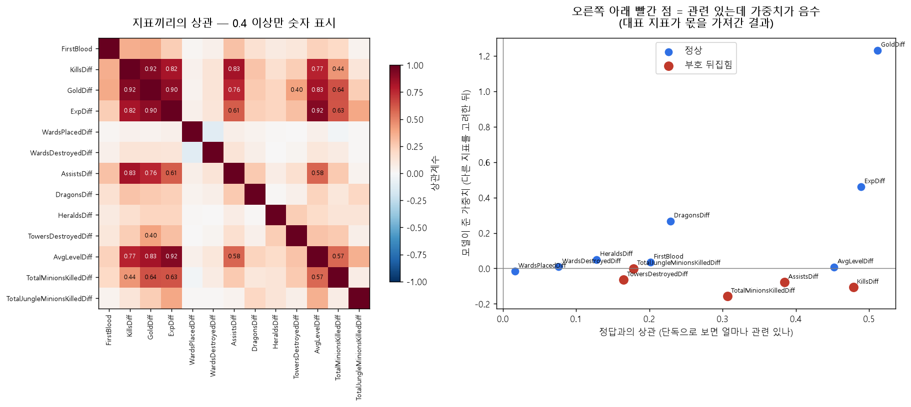

# 페이즈 2 — 상관이 높은 피처를 덜어내면 무엇이 달라지나

**실행**: `python src/feature_reduction.py`
**위치**: 페이즈 1(예측·원인 분석) 다음, 페이즈 3(시점 비교) 이전

---

## 왜 이 과정을 넣었나

모델 점수는 나왔는데, 계수를 보니 이상한 게 있었습니다.

**킬 차이는 승패와 분명히 관련이 있는데(상관 +0.48) 모델이 준 가중치는 음수(−0.11)** 입니다.
어시스트·미니언·타워도 마찬가지였습니다. 그대로 발표하면 "킬을 하면 진다"는 잘못된 결론이 나옵니다.

원인은 **지표끼리 너무 닮아서**입니다. 골드가 대표로 몫을 다 가져가고, 나머지는 남은 게 없어
부호가 뒤집힌 것입니다. 점수는 멀쩡한데 "무엇이 승패를 가르나"의 답만 왜곡됩니다.

그래서 상관행렬을 눈으로 확인하고, 겹치는 지표를 덜어낸 구성을 만들어 비교했습니다.

## 1. 상관행렬 히트맵으로 확인한 것

**상관 0.7 이상인 쌍이 8개**나 됩니다.

| 지표 A | 지표 B | 상관 |
|---|---|---|
| ExpDiff | AvgLevelDiff | **+0.920** |
| KillsDiff | GoldDiff | **+0.918** |
| GoldDiff | ExpDiff | +0.896 |
| GoldDiff | AvgLevelDiff | +0.834 |
| KillsDiff | AssistsDiff | +0.831 |
| KillsDiff | ExpDiff | +0.824 |
| KillsDiff | AvgLevelDiff | +0.767 |
| GoldDiff | AssistsDiff | +0.758 |

경험치와 레벨은 **레벨이 경험치로 계산되는 값**이라 사실상 같은 정보이고,
킬과 골드는 **킬을 하면 돈을 받기 때문에** 붙어 다닙니다.

오른쪽 그림에서 **빨간 점 5개**가 문제의 지표입니다 — 정답과 관련이 있는데(가로축 오른쪽)
가중치는 음수(세로축 아래)로 나온 것들입니다: `KillsDiff` `AssistsDiff` `TotalMinionsKilledDiff`
`TowersDestroyedDiff` `TotalJungleMinionsKilledDiff`

## 2. VIF — 수치로 확인

VIF는 "그 지표를 나머지 지표들로 예측했을 때 얼마나 잘 맞는가"입니다. **10을 넘으면 중복에 가깝습니다.**

| 지표 | VIF | |
|---|---|---|
| GoldDiff | **23.37** | 중복 의심 |
| KillsDiff | **14.07** | 중복 의심 |
| ExpDiff | **12.92** | 중복 의심 |
| AvgLevelDiff | 6.57 | |
| AssistsDiff | 3.99 | |

## 3. 덜어낸 구성 4가지를 비교

상관이 기준을 넘는 쌍에서 **정답과 덜 관련된 쪽을 버리는** 방식으로 구성을 만들었습니다.

| 구성 | 지표 수 | 교차검증 | 홀드아웃 | 부호 뒤집힌 지표 |
|---|---|---|---|---|
| 전체 13개 (현재) | 13 | 0.7315 ± 0.0153 | **0.7394** | 5.1개 |
| **상관 0.9 이상 제거** | **11** | **0.7321 ± 0.0161** | 0.7384 | **3.5개** |
| 상관 0.8 이상 제거 | 10 | 0.7276 ± 0.0157 | 0.7303 | 4.0개 |
| 상관 0.7 이상 제거 | 9 | 0.7276 ± 0.0154 | 0.7343 | **2.9개** |
| 골드+경험치 2개 | 2 | 0.7243 ± 0.0141 | 0.7328 | **0개** |

제거된 지표:

- **0.9 기준** → `KillsDiff`, `AvgLevelDiff` 제거
- 0.8 기준 → 위 + `ExpDiff` 제거
- 0.7 기준 → 위 + `AssistsDiff` 제거

## 4. 무엇을 알게 됐나

**첫째, 지표를 덜어내도 점수는 그대로입니다.**
13개 → 11개로 줄여도 교차검증은 오히려 **0.7315 → 0.7321로 미세하게 올랐고**,
홀드아웃은 0.7394 → 0.7384로 0.001 차이입니다. 표준편차(±0.015) 안이라 **차이가 없다고 봐야 합니다.**

**둘째, 해석은 확실히 깨끗해집니다.**
부호가 뒤집힌 지표가 **5.1개 → 3.5개**로 줄었습니다. 킬과 레벨을 빼는 것만으로
"관련 있는데 가중치가 음수"인 이상한 상황이 3분의 1 줄어든 것입니다.

**셋째, 1위 요인은 무엇을 빼도 골드입니다.**
모든 구성에서 시드 10회 전부 `GoldDiff`가 1위였습니다(10/10). **골드가 압도적이라는 결론은
지표 구성에 흔들리지 않습니다.** 이건 오히려 결론을 더 단단하게 해줍니다.

**넷째, 그렇다고 2개까지 줄이면 안 됩니다.**
골드+경험치 2개는 뒤집힘이 0이라 가장 깨끗하지만, 그러면 **"드래곤이 승패에 영향을 주나"**
같은 질문에 답할 수 없습니다. 설명할 재료 자체가 사라집니다.

## 5. 그래서 어떻게 하기로 했나

**최종 모델은 13개를 그대로 유지하되, 해석할 때 이 한계를 밝힙니다.**

이유는 이렇습니다.

- 점수 차이가 없으므로 성능을 근거로 바꿀 이유가 없습니다
- 13개를 유지해야 승리요인 순위표에 올릴 지표가 남습니다 (드래곤·전령·와드 등)
- 대신 **계수를 그대로 보여주지 않습니다** — 사용자 화면에는 효과크기 순위를 쓰고,
  계수는 "다른 지표를 고려한 뒤 남은 몫"이라는 설명과 함께만 제시합니다

즉 **이 실험의 결론은 "피처를 바꾸자"가 아니라 "왜 계수를 그대로 읽으면 안 되는지"의 근거**입니다.
발표에서 "킬 계수가 음수인데 왜 그런가"라는 질문이 나오면 이 표를 보여주면 됩니다.

## 6. 페이즈 3(시점 비교)으로 넘어가기 전에

여기까지가 **"10분 시점 안에서 할 수 있는 것"의 끝**입니다.

- 지표를 더 넣어도 점수가 안 오릅니다 (전부 같은 이야기를 다르게 재고 있어서)
- 지표를 빼도 점수가 안 내려갑니다 (정보가 골드에 몰려 있어서)
- 즉 **10분 정보량 자체가 상한**입니다

그래서 다음 실험은 지표를 바꾸는 게 아니라 **시점을 바꾸는 것**이어야 합니다.
"5분을 더 보면 무엇이 달라지나" — 이것이 **페이즈 3**입니다.

---

**산출 파일**: `phase2_correlation.png` · `phase2_comparison.png` · `phase2_feature_sets.csv` · `phase2_dropped.txt`
