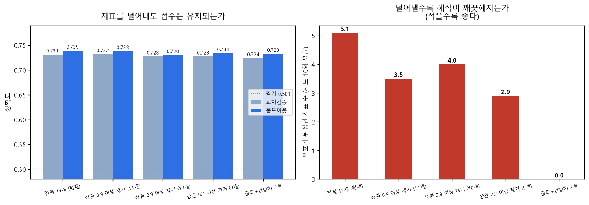

# 페이즈 2 — 골드를 빼고 다시 분석하면

**실행**: `python src/feature_reduction.py`
**위치**: 페이즈 1(예측·원인 분석) 다음, 페이즈 3(시점 비교) 이전

---

## 1. 왜 이 과정을 넣었나

페이즈 1의 계수 그림에서 **골드 하나가 +1.231로 나머지를 전부 눌러버렸습니다.**
그리고 그 옆에 이상한 게 있었습니다.

**킬 차이는 승패와 분명히 관련이 있는데(상관 +0.48) 모델이 준 가중치는 음수(-0.107)** 입니다.
어시스트·미니언·타워도 마찬가지였습니다. 그대로 발표하면 "킬을 하면 진다"는 잘못된 결론이 나옵니다.

원인을 찾으려고 상관행렬부터 확인했습니다.

## 2. 히트맵 — 중복의 중심은 골드였다

**상관 0.7 이상인 쌍이 8개**인데, **그중 4개가 골드가 낀 쌍**입니다.

| 지표 A | 지표 B | 상관 |
|---|---|---|
| ExpDiff | AvgLevelDiff | +0.920 |
| **KillsDiff** | **GoldDiff** | **+0.918** |
| **GoldDiff** | **ExpDiff** | **+0.896** |
| **GoldDiff** | **AvgLevelDiff** | **+0.834** |
| KillsDiff | AssistsDiff | +0.831 |
| KillsDiff | ExpDiff | +0.824 |
| KillsDiff | AvgLevelDiff | +0.767 |
| **GoldDiff** | **AssistsDiff** | **+0.758** |

VIF로 봐도 **골드가 23.37로 1위**입니다(10 이상이면 중복에 가깝다는 뜻).

| 지표 | VIF | |
|---|---|---|
| **GoldDiff** | **23.37** | 중복 1위 |
| KillsDiff | 14.07 | 중복 의심 |
| ExpDiff | 12.92 | 중복 의심 |
| AvgLevelDiff | 6.57 | |
| AssistsDiff | 3.99 | |

이유는 게임 규칙에 있습니다. **킬을 하면 돈을 받고, 미니언을 잡아도 받고, 타워를 밀어도 받습니다.**
골드는 그 모두를 한 번에 담은 지표라, 모델이 골드에만 가중치를 몰아주고
같은 이야기를 반복하는 나머지 지표에는 남은 오차를 떠넘겨 음수로 만든 것입니다.

그래서 **상관이 가장 높은 골드 자체를 빼고 처음부터 다시 학습**했습니다.

## 3. 골드를 빼니 무엇이 달라졌나

### 3-1. 눌려 있던 지표가 살아났다

| 지표 | 골드 포함 | 골드 제외 | |
|---|---|---|---|
| **KillsDiff** | **-0.107** | **+0.508** | 방향이 바뀌고 크기 5배 |
| TotalMinionsKilledDiff | -0.157 | +0.114 | 음수 -> 양수 |
| AssistsDiff | -0.079 | +0.096 | 음수 -> 양수 |
| TowersDestroyedDiff | -0.064 | +0.114 | 음수 -> 양수 |
| TotalJungleMinionsKilledDiff | -0.000 | +0.107 | 사실상 0 -> 양수 |
| ExpDiff (참고) | +0.461 | +0.650 | 원래 양수, 더 커짐 |

**음수로 눌려 있던 5개가 전부 양수로 올라왔습니다.**

이게 핵심입니다. **킬이 승패와 무관했던 게 아니라, 골드가 킬의 몫까지 가져가고 있었던 것**입니다.
페이즈 1에서 나온 음수 계수는 이걸로 설명됩니다.

### 3-2. 그런데 점수는 거의 안 떨어졌다

| 구성 | 지표 수 | 교차검증 | 홀드아웃 | 1위 요인 |
|---|---|---|---|---|
| 전체 13개 | 13 | 0.7315 | **0.7394** | GoldDiff +1.23 |
| **골드 제외** | 12 | 0.7214 | **0.7373** | ExpDiff +0.65 · KillsDiff +0.51 |
| 골드+경험치 제외 | 11 | 0.7197 | 0.7328 | KillsDiff +0.79 |
| 성장 지표 전부 제외 | 7 | 0.6409 | 0.6336 | DragonsDiff +0.37 |

가장 강한 지표를 통째로 뺐는데 **홀드아웃이 0.7394 -> 0.7373, 0.0020 차이**입니다.

**골드가 특별해서 1위였던 게 아니라, 다른 지표들이 이미 같은 정보를 담고 있어서**
골드가 없어도 경험치와 킬이 그 자리를 대신 채웁니다.

### 3-3. 진짜 한계선도 보였다

골드·경험치·킬·레벨·어시스트·미니언 같은 **성장 지표를 전부 빼면 0.6336으로 확 떨어집니다.**
드래곤·전령·와드만으로는 안 된다는 뜻입니다.

**"10분 승패는 결국 성장 격차가 가른다"**는 페이즈 1의 결론이, 빼는 방향에서도 확인된 셈입니다.

## 4. 참고 — 상관 기준으로 덜어낸 구성

골드를 빼는 것과 별개로, 상관이 기준을 넘는 쌍에서 **정답과 덜 관련된 쪽을 버리는** 방식도 함께 비교했습니다.
이쪽은 골드가 항상 살아남기 때문에 계수 왜곡이 완전히 풀리지는 않습니다.

| 구성 | 지표 수 | 교차검증 | 홀드아웃 | 부호 뒤집힌 지표 |
|---|---|---|---|---|
| 전체 13개 | 13 | 0.7315 ± 0.0153 | **0.7394** | 5.1개 |
| 상관 0.9 이상 제거 | 11 | 0.7321 ± 0.0161 | 0.7384 | 3.5개 |
| 상관 0.8 이상 제거 | 10 | 0.7276 ± 0.0157 | 0.7303 | 4.0개 |
| 상관 0.7 이상 제거 | 9 | 0.7276 ± 0.0154 | 0.7343 | 2.9개 |
| 골드+경험치 2개 | 2 | 0.7243 ± 0.0141 | 0.7328 | 0개 |

여기서도 **모든 구성에서 시드 10회 전부 GoldDiff가 1위**였습니다(10/10).
지표 구성을 어떻게 바꿔도 골드가 1위라는 결론은 흔들리지 않습니다.

## 5. 그래서 어떻게 하기로 했나

**최종 모델은 13개를 그대로 씁니다.** 점수가 가장 높고, 드래곤·전령 같은 지표를 순위표에 남겨야 하기 때문입니다.

**대신 계수를 그대로 읽지 않습니다.**

- 사용자 화면에는 **효과크기(Cohen's d) 순위**를 씁니다
- 계수는 "다른 지표를 고려한 뒤 남은 몫"이라는 설명과 함께만 제시합니다
- **"킬 계수가 왜 음수냐"는 질문에는 3-1의 표를 보여줍니다** — 골드를 빼면 +0.508입니다

즉 **이 실험의 결론은 "피처를 바꾸자"가 아니라, "왜 계수를 그대로 읽으면 안 되는지"의 근거**입니다.

## 6. 페이즈 3으로 넘어가기 전에

여기까지가 **10분 시점 안에서 할 수 있는 것의 끝**입니다.

- 가장 강한 지표를 빼도 점수가 0.002밖에 안 떨어집니다 (정보가 서로 겹쳐 있어서)
- 지표를 더 넣어도 오르지 않습니다 (전부 같은 이야기를 다르게 재고 있어서)
- 즉 **10분 정보량 자체가 상한**입니다

그래서 다음 실험은 지표를 바꾸는 게 아니라 **시점을 바꾸는 것**이어야 합니다.
보충 실험(차원 축소·군집 모델 비교·나이브베이즈)으로도 이 상한이 그대로임을 확인했습니다.
"5분을 더 보면 무엇이 달라지나" — 이것이 **페이즈 3**입니다.

---

**산출 파일**: `07_phase2_without_gold.png` · `tables/phase2_without_gold.csv` ·
`figures/phase2_correlation.png` · `figures/phase2_comparison.png` ·
`tables/phase2_feature_sets.csv` · `tables/phase2_dropped.txt`
